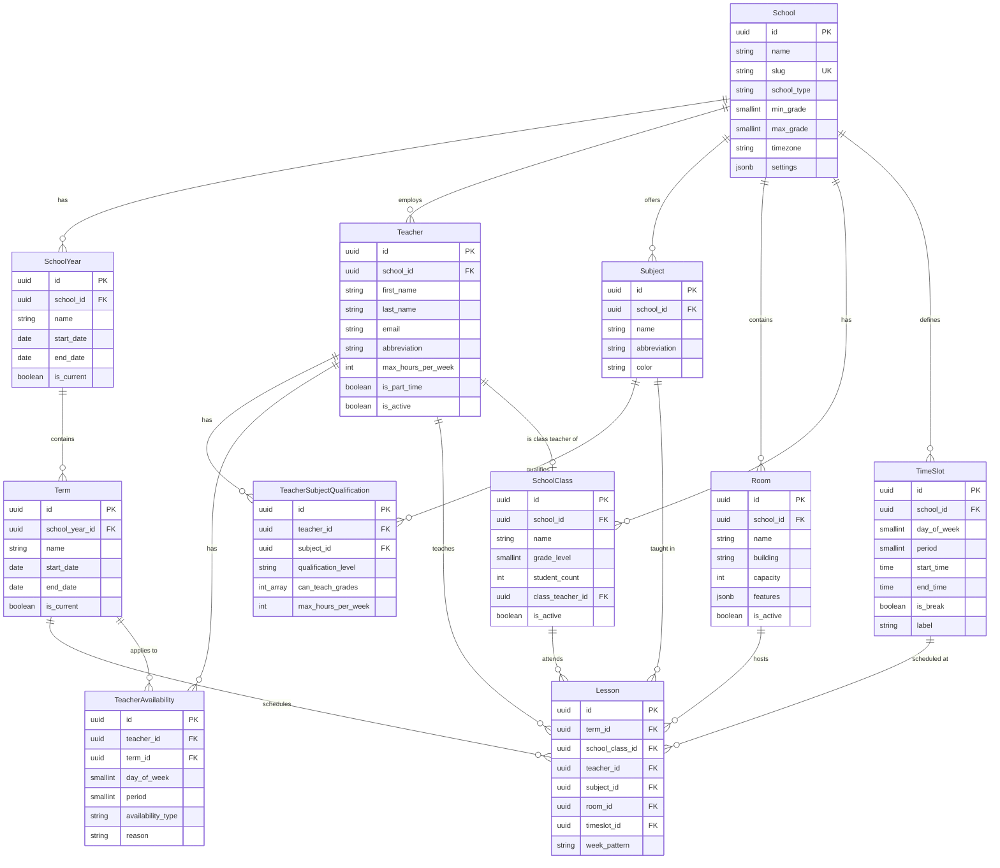

# Klassenzeit Data Model

This document describes the database schema for Klassenzeit, a school timetabler application.

## Entity Relationship Diagram

## Entity Descriptions

### Core Entities

| Entity | Description |
|--------|-------------|
| **School** | The root tenant entity. Supports multi-tenant deployment where each school is isolated. |
| **SchoolYear** | An academic year (e.g., "2024/2025"). Contains terms. |
| **Term** | A period within a school year (e.g., "1. Halbjahr"). Lessons are scheduled per term. |

### Resource Entities

| Entity | Description |
|--------|-------------|
| **Teacher** | A teacher with availability constraints and max teaching hours. |
| **Subject** | A subject taught at the school (e.g., "Mathematik"). |
| **Room** | A physical room with capacity and features (projector, computers, etc.). |
| **SchoolClass** | A class/group of students (e.g., "3a", "5b"). |
| **TimeSlot** | Defines the weekly time grid (day + period + times). |

### Relationship Entities

| Entity | Description |
|--------|-------------|
| **TeacherSubjectQualification** | Tracks which subjects a teacher can teach and at what level (PRIMARY/SECONDARY/SUBSTITUTE). |
| **TeacherAvailability** | When a teacher is AVAILABLE, BLOCKED, or PREFERRED for scheduling. |
| **Lesson** | The actual scheduled timetable entry linking class, teacher, subject, room, and time slot. |

## Key Constraints

### Uniqueness Constraints

- `Lesson`: A class/teacher/room can only be in one place at a time (per term + timeslot + week_pattern)
- `Teacher.abbreviation`: Unique per school
- `Subject.abbreviation`: Unique per school
- `Room.name`: Unique per school
- `SchoolClass.name`: Unique per school

### Check Constraints

- `School.min_grade <= School.max_grade`
- `TimeSlot.start_time < TimeSlot.end_time`
- `TimeSlot.day_of_week` between 0 (Monday) and 4 (Friday)
- `TeacherAvailability.period` between 1 and 10

## Enums

| Enum | Values | Description |
|------|--------|-------------|
| `qualification_level` | PRIMARY, SECONDARY, SUBSTITUTE | Teacher's qualification for a subject |
| `availability_type` | AVAILABLE, BLOCKED, PREFERRED | Teacher's availability status for a time slot |
| `week_pattern` | EVERY, A, B | For A/B week rotation (default: EVERY) |

## Generating Documentation

Run `make db-docs` to generate interactive HTML documentation with ER diagrams from the live database using SchemaSpy.
