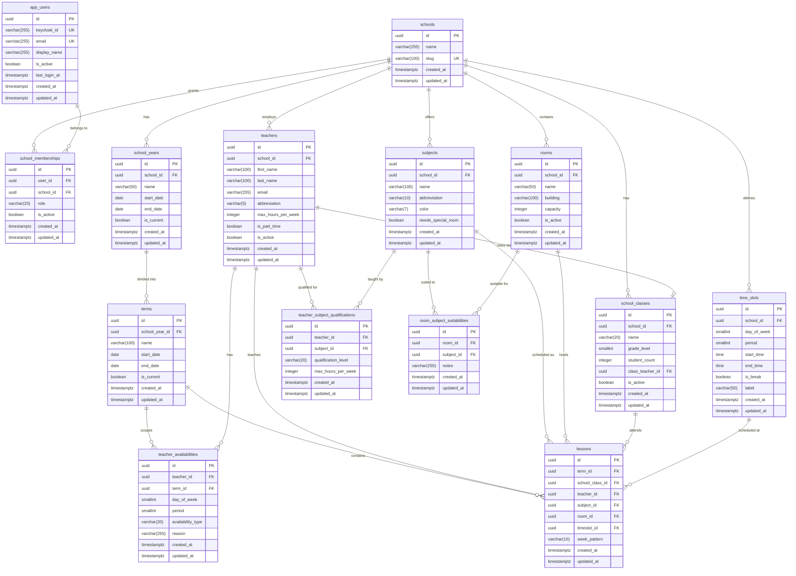

# Database Schema

This document describes the complete database schema for Klassenzeit, including all tables, relationships, constraints, and the multi-tenancy model.

## Entity-Relationship Diagram

## Table Descriptions

### Organizational

| Table | Purpose |
|-------|---------|
| **schools** | Top-level tenant entity representing a school. Every tenant-scoped resource belongs to exactly one school, identified by a unique slug used in URLs. |
| **school_years** | Academic years within a school (e.g., "2025/26"). Defines the date range for an academic cycle; one year can be marked as current. |
| **terms** | Sub-divisions of a school year (e.g., semesters or quarters). Lessons and term-specific teacher availabilities are scoped to a term. |

### Core Resources

| Table | Purpose |
|-------|---------|
| **teachers** | Teaching staff at a school, identified by a unique abbreviation (e.g., "MUL"). Tracks weekly hour limits and part-time status for scheduling. |
| **subjects** | Curriculum subjects offered by a school (e.g., "Mathematics"), identified by a unique abbreviation. Flags whether the subject requires a special room. |
| **rooms** | Physical rooms available for lessons, with optional capacity and building info. Can be marked inactive to temporarily exclude from scheduling. |
| **school_classes** | Student groups (e.g., "5a"), each with a grade level and optional class teacher assignment. Student count is used by the scheduler for room capacity checks. |
| **time_slots** | The weekly grid of periods for a school (e.g., Monday period 1, 08:00-08:45). Defines which day/period combinations exist and their clock times. |

### Relationships

| Table | Purpose |
|-------|---------|
| **teacher_subject_qualifications** | Links teachers to the subjects they can teach, with a qualification level (primary, secondary, substitute) and optional per-subject hour cap. |
| **teacher_availabilities** | Records when a teacher is available, blocked, or prefers to teach at a given day/period. Can be global (term_id NULL) or term-specific. |
| **room_subject_suitabilities** | Marks which rooms are suitable for which subjects (e.g., physics lab for Physics). Used by the scheduler when a subject requires a special room. |

### Timetable

| Table | Purpose |
|-------|---------|
| **lessons** | The core scheduling output: one row per scheduled lesson, linking a class, teacher, subject, room, and time slot within a term. Supports A/B week patterns. |

### Auth & Access

| Table | Purpose |
|-------|---------|
| **app_users** | Application user accounts, linked to Keycloak via `keycloak_id`. Stores display name and login tracking. |
| **school_memberships** | Grants a user access to a school with a specific role (admin, teacher, viewer). One membership per user per school. |

## Hard Constraints (Database-Enforced)

### Data Integrity

| Table | Constraint | Rule |
|-------|-----------|------|
| school_years | `ck_school_years_dates` | `start_date < end_date` |
| terms | `ck_terms_dates` | `start_date < end_date` |
| time_slots | `ck_time_slots_day` | `day_of_week` between 0 and 4 (Mon-Fri) |
| time_slots | `ck_time_slots_period` | `period` between 1 and 10 |
| time_slots | `ck_time_slots_times` | `start_time < end_time` |
| teacher_subject_qualifications | `ck_tsq_level` | `qualification_level` in (`primary`, `secondary`, `substitute`) |
| teacher_availabilities | `ck_teacher_avail_day` | `day_of_week` between 0 and 4 (Mon-Fri) |
| teacher_availabilities | `ck_teacher_avail_period` | `period` between 1 and 10 |
| teacher_availabilities | `ck_teacher_avail_type` | `availability_type` in (`available`, `blocked`, `preferred`) |
| lessons | `ck_lessons_week_pattern` | `week_pattern` in (`every`, `a`, `b`) |
| school_memberships | `ck_membership_role` | `role` in (`admin`, `teacher`, `viewer`) |

### Uniqueness

| Table | Constraint | Columns |
|-------|-----------|---------|
| school_years | `uq_school_years_school_name` | (school_id, name) |
| rooms | `uq_rooms_school_name` | (school_id, name) |
| school_classes | `uq_school_classes_school_name` | (school_id, name) |
| teachers | `uq_teachers_school_abbreviation` | (school_id, abbreviation) |
| subjects | `uq_subjects_school_abbreviation` | (school_id, abbreviation) |
| time_slots | `uq_time_slots_school_day_period` | (school_id, day_of_week, period) |
| teacher_subject_qualifications | `uq_tsq_teacher_subject` | (teacher_id, subject_id) |
| room_subject_suitabilities | `uq_rss_room_subject` | (room_id, subject_id) |
| teacher_availabilities | `uq_teacher_avail_default` | (teacher_id, day_of_week, period) WHERE term_id IS NULL |
| teacher_availabilities | `uq_teacher_avail_term` | (teacher_id, term_id, day_of_week, period) WHERE term_id IS NOT NULL |
| school_memberships | `uq_school_membership_user_school` | (user_id, school_id) |
| schools | `schools_slug_key` | (slug) |
| app_users | `app_users_keycloak_id_key` | (keycloak_id) |
| app_users | `app_users_email_key` | (email) |

### Collision Prevention

These unique indexes on the **lessons** table prevent double-booking:

| Constraint | Columns | Description |
|-----------|---------|-------------|
| `uq_lessons_class_timeslot` | (term_id, school_class_id, timeslot_id, week_pattern) | A class cannot have two lessons in the same slot and week pattern |
| `uq_lessons_teacher_timeslot` | (term_id, teacher_id, timeslot_id, week_pattern) | A teacher cannot teach two lessons in the same slot and week pattern |
| `uq_lessons_room_timeslot` | (term_id, room_id, timeslot_id, week_pattern) WHERE room_id IS NOT NULL | A room cannot host two lessons in the same slot and week pattern |

## Cascade Deletes

When a parent record is deleted, the following child records are automatically removed:

| Deleted Parent | Cascaded Deletions |
|---------------|-------------------|
| **school** | school_years, terms (via school_years), teachers, subjects, rooms, school_classes, time_slots, school_memberships, and all their dependents (lessons, qualifications, availabilities, suitabilities) |
| **school_year** | terms, and all term dependents (lessons, term-specific teacher_availabilities) |
| **term** | lessons, term-specific teacher_availabilities |
| **teacher** | teacher_subject_qualifications, teacher_availabilities, lessons; school_classes.class_teacher_id set to NULL |
| **subject** | teacher_subject_qualifications, room_subject_suitabilities, lessons |
| **room** | room_subject_suitabilities; lessons.room_id set to NULL |
| **school_class** | lessons |
| **time_slot** | lessons |
| **app_user** | school_memberships |

## Soft Constraints (Scheduler-Enforced)

These constraints are not enforced by the database but are evaluated by the scheduler during timetable optimization.

### Hard Score (must not violate)

| Constraint | Description |
|-----------|-------------|
| Teacher blocked slots | A teacher must not be scheduled during a time slot where their availability is `blocked` |
| Teacher qualification required | A teacher must have a `teacher_subject_qualification` entry for the subject they are assigned to teach |
| Room-subject suitability | If a subject has `needs_special_room = true`, the assigned room must have a matching `room_subject_suitability` entry |

### Soft Score (minimize violations)

| Constraint | Description |
|-----------|-------------|
| Teacher max hours | Total weekly lessons for a teacher should not exceed `teachers.max_hours_per_week` |
| Teacher preferred slots | Prefer scheduling teachers in time slots where their availability is `preferred` |
| Room capacity | Prefer rooms where `rooms.capacity >= school_classes.student_count` |
| Part-time compactness | Part-time teachers (`is_part_time = true`) should have lessons grouped into fewer days |
| Class teacher proximity | A class teacher should teach their own class during early periods when possible |
| Daily subject spread | Avoid scheduling the same subject more than once per day for a class |
| Consecutive lessons | Prefer grouping lessons of the same subject for a class into consecutive periods (double periods) |

## Enum Values

### qualification_level

| Value | Meaning |
|-------|---------|
| `primary` | Main subject qualification; the teacher is fully trained for this subject |
| `secondary` | Additional qualification; the teacher can teach this subject but it is not their primary field |
| `substitute` | Emergency/substitute qualification; the teacher can cover this subject temporarily |

### availability_type

| Value | Meaning |
|-------|---------|
| `available` | The teacher is available during this time slot (default assumption) |
| `blocked` | The teacher must not be scheduled during this slot (hard constraint) |
| `preferred` | The teacher prefers to be scheduled during this slot (soft constraint) |

### week_pattern

| Value | Meaning |
|-------|---------|
| `every` | The lesson occurs every week |
| `a` | The lesson occurs only in A-weeks (biweekly rotation) |
| `b` | The lesson occurs only in B-weeks (biweekly rotation) |

### role

| Value | Meaning |
|-------|---------|
| `admin` | Full administrative access to the school: manage resources, run scheduler, manage members |
| `teacher` | Can view timetables and manage own availability |
| `viewer` | Read-only access to timetables |

## Multi-Tenancy

Klassenzeit uses row-level tenant isolation with `school_id` as the tenant identifier.

**Direct scoping**: The tables `school_years`, `teachers`, `subjects`, `rooms`, `school_classes`, `time_slots`, and `school_memberships` each have a `school_id` foreign key. Every query against these tables must filter by the authenticated user's school.

**Indirect scoping**: `terms` are scoped through `school_years.school_id`. `lessons` are scoped through `terms` (and transitively through `school_years`). `teacher_subject_qualifications`, `teacher_availabilities`, and `room_subject_suitabilities` are scoped through their parent `teacher` or `room`/`subject`, which themselves carry `school_id`.

**Enforcement**: The backend middleware extracts `school_id` from the authenticated user's JWT claims and injects it into all queries. There are no cross-school foreign keys, so a cascading delete of a school cleanly removes all its data.
