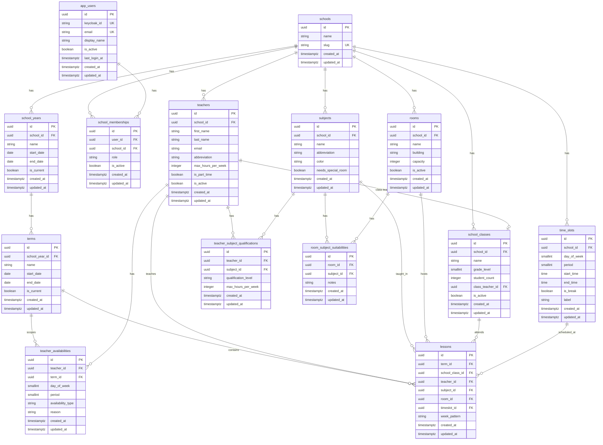

# Domain Tables Migration — Implementation Plan

> **For agentic workers:** REQUIRED SUB-SKILL: Use superpowers:subagent-driven-development (recommended) or superpowers:executing-plans to implement this plan task-by-task. Steps use checkbox (`- [ ]`) syntax for tracking.

**Goal:** Add all timetabling domain tables (school_years, terms, teachers, subjects, rooms, school_classes, time_slots, qualifications, availabilities, suitabilities, lessons) and create ERD + constraint documentation.

**Architecture:** Single SeaORM migration adds 10 tables with FK chains rooted at `schools`. Hand-written entity files follow the existing `_entities/` + model wrapper pattern. Mermaid ERD in mdBook documents the full schema with hard/soft constraints.

**Tech Stack:** SeaORM migrations, SeaORM entities (hand-written), mdBook + Mermaid

---

## File Map

**Migration:**
- Create: `backend/migration/src/m20250403_000002_domain_tables.rs`
- Modify: `backend/migration/src/lib.rs`

**Entities (`_entities/` — struct + relations, no logic):**
- Create: `backend/src/models/_entities/school_years.rs`
- Create: `backend/src/models/_entities/terms.rs`
- Create: `backend/src/models/_entities/teachers.rs`
- Create: `backend/src/models/_entities/subjects.rs`
- Create: `backend/src/models/_entities/rooms.rs`
- Create: `backend/src/models/_entities/school_classes.rs`
- Create: `backend/src/models/_entities/time_slots.rs`
- Create: `backend/src/models/_entities/teacher_subject_qualifications.rs`
- Create: `backend/src/models/_entities/teacher_availabilities.rs`
- Create: `backend/src/models/_entities/room_subject_suitabilities.rs`
- Create: `backend/src/models/_entities/lessons.rs`
- Modify: `backend/src/models/_entities/mod.rs`
- Modify: `backend/src/models/_entities/prelude.rs`
- Modify: `backend/src/models/_entities/schools.rs` (add new relations)

**Model wrappers (ActiveModelBehavior + constructors):**
- Create: `backend/src/models/school_years.rs`
- Create: `backend/src/models/terms.rs`
- Create: `backend/src/models/teachers.rs`
- Create: `backend/src/models/subjects.rs`
- Create: `backend/src/models/rooms.rs`
- Create: `backend/src/models/school_classes.rs`
- Create: `backend/src/models/time_slots.rs`
- Create: `backend/src/models/teacher_subject_qualifications.rs`
- Create: `backend/src/models/teacher_availabilities.rs`
- Create: `backend/src/models/room_subject_suitabilities.rs`
- Create: `backend/src/models/lessons.rs`
- Modify: `backend/src/models/mod.rs`

**Tests:**
- Create: `backend/tests/models/domain_tables.rs`
- Modify: `backend/tests/models/mod.rs`

**Documentation:**
- Create: `docs/src/database-schema.md`
- Modify: `docs/src/SUMMARY.md`

---

### Task 1: Migration File — Organizational Tables (school_years, terms)

**Files:**
- Create: `backend/migration/src/m20250403_000002_domain_tables.rs`
- Modify: `backend/migration/src/lib.rs`

- [ ] **Step 1: Create migration file with school_years and terms tables**

Create `backend/migration/src/m20250403_000002_domain_tables.rs`:

```rust
use sea_orm_migration::prelude::*;

#[derive(DeriveMigrationName)]
pub struct Migration;

#[async_trait::async_trait]
impl MigrationTrait for Migration {
    async fn up(&self, manager: &SchemaManager) -> Result<(), DbErr> {
        // school_years
        manager
            .create_table(
                Table::create()
                    .table(SchoolYears::Table)
                    .if_not_exists()
                    .col(ColumnDef::new(SchoolYears::Id).uuid().not_null().primary_key())
                    .col(ColumnDef::new(SchoolYears::SchoolId).uuid().not_null())
                    .col(ColumnDef::new(SchoolYears::Name).string_len(50).not_null())
                    .col(ColumnDef::new(SchoolYears::StartDate).date().not_null())
                    .col(ColumnDef::new(SchoolYears::EndDate).date().not_null())
                    .col(
                        ColumnDef::new(SchoolYears::IsCurrent)
                            .boolean()
                            .not_null()
                            .default(false),
                    )
                    .col(
                        ColumnDef::new(SchoolYears::CreatedAt)
                            .timestamp_with_time_zone()
                            .not_null(),
                    )
                    .col(
                        ColumnDef::new(SchoolYears::UpdatedAt)
                            .timestamp_with_time_zone()
                            .not_null(),
                    )
                    .foreign_key(
                        ForeignKey::create()
                            .name("fk_school_years_school")
                            .from(SchoolYears::Table, SchoolYears::SchoolId)
                            .to(Schools::Table, Schools::Id)
                            .on_delete(ForeignKeyAction::Cascade),
                    )
                    .to_owned(),
            )
            .await?;

        manager
            .create_index(
                Index::create()
                    .name("idx_school_years_school")
                    .table(SchoolYears::Table)
                    .col(SchoolYears::SchoolId)
                    .to_owned(),
            )
            .await?;

        manager
            .create_index(
                Index::create()
                    .name("uq_school_years_name")
                    .table(SchoolYears::Table)
                    .col(SchoolYears::SchoolId)
                    .col(SchoolYears::Name)
                    .unique()
                    .to_owned(),
            )
            .await?;

        // terms
        manager
            .create_table(
                Table::create()
                    .table(Terms::Table)
                    .if_not_exists()
                    .col(ColumnDef::new(Terms::Id).uuid().not_null().primary_key())
                    .col(ColumnDef::new(Terms::SchoolYearId).uuid().not_null())
                    .col(ColumnDef::new(Terms::Name).string_len(100).not_null())
                    .col(ColumnDef::new(Terms::StartDate).date().not_null())
                    .col(ColumnDef::new(Terms::EndDate).date().not_null())
                    .col(
                        ColumnDef::new(Terms::IsCurrent)
                            .boolean()
                            .not_null()
                            .default(false),
                    )
                    .col(
                        ColumnDef::new(Terms::CreatedAt)
                            .timestamp_with_time_zone()
                            .not_null(),
                    )
                    .col(
                        ColumnDef::new(Terms::UpdatedAt)
                            .timestamp_with_time_zone()
                            .not_null(),
                    )
                    .foreign_key(
                        ForeignKey::create()
                            .name("fk_terms_school_year")
                            .from(Terms::Table, Terms::SchoolYearId)
                            .to(SchoolYears::Table, SchoolYears::Id)
                            .on_delete(ForeignKeyAction::Cascade),
                    )
                    .to_owned(),
            )
            .await?;

        manager
            .create_index(
                Index::create()
                    .name("idx_terms_school_year")
                    .table(Terms::Table)
                    .col(Terms::SchoolYearId)
                    .to_owned(),
            )
            .await?;

        // CHECK constraints via raw SQL
        let db = manager.get_connection();
        db.execute_unprepared(
            "ALTER TABLE school_years ADD CONSTRAINT ck_school_years_dates CHECK (start_date < end_date)"
        ).await?;
        db.execute_unprepared(
            "ALTER TABLE terms ADD CONSTRAINT ck_terms_dates CHECK (start_date < end_date)"
        ).await?;

        Ok(())
    }

    async fn down(&self, manager: &SchemaManager) -> Result<(), DbErr> {
        manager.drop_table(Table::drop().table(Terms::Table).to_owned()).await?;
        manager.drop_table(Table::drop().table(SchoolYears::Table).to_owned()).await?;
        Ok(())
    }
}

// Iden enums — reference existing tables

#[derive(Iden)]
enum Schools {
    Table,
    Id,
}

#[derive(Iden)]
enum SchoolYears {
    Table,
    Id,
    SchoolId,
    Name,
    StartDate,
    EndDate,
    IsCurrent,
    CreatedAt,
    UpdatedAt,
}

#[derive(Iden)]
enum Terms {
    Table,
    Id,
    SchoolYearId,
    Name,
    StartDate,
    EndDate,
    IsCurrent,
    CreatedAt,
    UpdatedAt,
}
```

Note: This is the starting point. Tasks 2 and 3 will add more tables and their Iden enums to this same file. The `down()` method will also grow to drop all tables in reverse order.

- [ ] **Step 2: Register migration in lib.rs**

In `backend/migration/src/lib.rs`, add the module and register it:

```rust
#![allow(elided_lifetimes_in_paths)]
#![allow(clippy::wildcard_imports)]
pub use sea_orm_migration::prelude::*;
mod m20250403_000001_core_tables;
mod m20250403_000002_domain_tables;

pub struct Migrator;

#[async_trait::async_trait]
impl MigratorTrait for Migrator {
    fn migrations() -> Vec<Box<dyn MigrationTrait>> {
        vec![
            Box::new(m20250403_000001_core_tables::Migration),
            Box::new(m20250403_000002_domain_tables::Migration),
            // inject-above (do not remove this comment)
        ]
    }
}
```

- [ ] **Step 3: Verify it compiles**

Run: `cargo check -p migration`
Expected: compiles with no errors

- [ ] **Step 4: Commit**

```bash
git add backend/migration/src/m20250403_000002_domain_tables.rs backend/migration/src/lib.rs
git commit -m "migration: add school_years and terms tables"
```

---

### Task 2: Migration File — Core Resource Tables

**Files:**
- Modify: `backend/migration/src/m20250403_000002_domain_tables.rs`

Add teachers, subjects, rooms, school_classes, and time_slots to the existing migration's `up()` method. This task extends the migration file from Task 1.

- [ ] **Step 1: Add teachers, subjects, rooms, school_classes, time_slots to up()**

Append to the `up()` method in `m20250403_000002_domain_tables.rs`, before the CHECK constraints section:

```rust
        // teachers
        manager
            .create_table(
                Table::create()
                    .table(Teachers::Table)
                    .if_not_exists()
                    .col(ColumnDef::new(Teachers::Id).uuid().not_null().primary_key())
                    .col(ColumnDef::new(Teachers::SchoolId).uuid().not_null())
                    .col(ColumnDef::new(Teachers::FirstName).string_len(100).not_null())
                    .col(ColumnDef::new(Teachers::LastName).string_len(100).not_null())
                    .col(ColumnDef::new(Teachers::Email).string_len(255))
                    .col(ColumnDef::new(Teachers::Abbreviation).string_len(5).not_null())
                    .col(
                        ColumnDef::new(Teachers::MaxHoursPerWeek)
                            .integer()
                            .not_null()
                            .default(28),
                    )
                    .col(
                        ColumnDef::new(Teachers::IsPartTime)
                            .boolean()
                            .not_null()
                            .default(false),
                    )
                    .col(
                        ColumnDef::new(Teachers::IsActive)
                            .boolean()
                            .not_null()
                            .default(true),
                    )
                    .col(ColumnDef::new(Teachers::CreatedAt).timestamp_with_time_zone().not_null())
                    .col(ColumnDef::new(Teachers::UpdatedAt).timestamp_with_time_zone().not_null())
                    .foreign_key(
                        ForeignKey::create()
                            .name("fk_teachers_school")
                            .from(Teachers::Table, Teachers::SchoolId)
                            .to(Schools::Table, Schools::Id)
                            .on_delete(ForeignKeyAction::Cascade),
                    )
                    .to_owned(),
            )
            .await?;

        manager
            .create_index(
                Index::create()
                    .name("idx_teachers_school")
                    .table(Teachers::Table)
                    .col(Teachers::SchoolId)
                    .to_owned(),
            )
            .await?;

        manager
            .create_index(
                Index::create()
                    .name("uq_teachers_abbreviation")
                    .table(Teachers::Table)
                    .col(Teachers::SchoolId)
                    .col(Teachers::Abbreviation)
                    .unique()
                    .to_owned(),
            )
            .await?;

        // subjects
        manager
            .create_table(
                Table::create()
                    .table(Subjects::Table)
                    .if_not_exists()
                    .col(ColumnDef::new(Subjects::Id).uuid().not_null().primary_key())
                    .col(ColumnDef::new(Subjects::SchoolId).uuid().not_null())
                    .col(ColumnDef::new(Subjects::Name).string_len(100).not_null())
                    .col(ColumnDef::new(Subjects::Abbreviation).string_len(10).not_null())
                    .col(ColumnDef::new(Subjects::Color).string_len(7))
                    .col(
                        ColumnDef::new(Subjects::NeedsSpecialRoom)
                            .boolean()
                            .not_null()
                            .default(false),
                    )
                    .col(ColumnDef::new(Subjects::CreatedAt).timestamp_with_time_zone().not_null())
                    .col(ColumnDef::new(Subjects::UpdatedAt).timestamp_with_time_zone().not_null())
                    .foreign_key(
                        ForeignKey::create()
                            .name("fk_subjects_school")
                            .from(Subjects::Table, Subjects::SchoolId)
                            .to(Schools::Table, Schools::Id)
                            .on_delete(ForeignKeyAction::Cascade),
                    )
                    .to_owned(),
            )
            .await?;

        manager
            .create_index(
                Index::create()
                    .name("idx_subjects_school")
                    .table(Subjects::Table)
                    .col(Subjects::SchoolId)
                    .to_owned(),
            )
            .await?;

        manager
            .create_index(
                Index::create()
                    .name("uq_subjects_abbreviation")
                    .table(Subjects::Table)
                    .col(Subjects::SchoolId)
                    .col(Subjects::Abbreviation)
                    .unique()
                    .to_owned(),
            )
            .await?;

        // rooms
        manager
            .create_table(
                Table::create()
                    .table(Rooms::Table)
                    .if_not_exists()
                    .col(ColumnDef::new(Rooms::Id).uuid().not_null().primary_key())
                    .col(ColumnDef::new(Rooms::SchoolId).uuid().not_null())
                    .col(ColumnDef::new(Rooms::Name).string_len(50).not_null())
                    .col(ColumnDef::new(Rooms::Building).string_len(100))
                    .col(ColumnDef::new(Rooms::Capacity).integer())
                    .col(
                        ColumnDef::new(Rooms::IsActive)
                            .boolean()
                            .not_null()
                            .default(true),
                    )
                    .col(ColumnDef::new(Rooms::CreatedAt).timestamp_with_time_zone().not_null())
                    .col(ColumnDef::new(Rooms::UpdatedAt).timestamp_with_time_zone().not_null())
                    .foreign_key(
                        ForeignKey::create()
                            .name("fk_rooms_school")
                            .from(Rooms::Table, Rooms::SchoolId)
                            .to(Schools::Table, Schools::Id)
                            .on_delete(ForeignKeyAction::Cascade),
                    )
                    .to_owned(),
            )
            .await?;

        manager
            .create_index(
                Index::create()
                    .name("idx_rooms_school")
                    .table(Rooms::Table)
                    .col(Rooms::SchoolId)
                    .to_owned(),
            )
            .await?;

        manager
            .create_index(
                Index::create()
                    .name("uq_rooms_name")
                    .table(Rooms::Table)
                    .col(Rooms::SchoolId)
                    .col(Rooms::Name)
                    .unique()
                    .to_owned(),
            )
            .await?;

        // school_classes
        manager
            .create_table(
                Table::create()
                    .table(SchoolClasses::Table)
                    .if_not_exists()
                    .col(ColumnDef::new(SchoolClasses::Id).uuid().not_null().primary_key())
                    .col(ColumnDef::new(SchoolClasses::SchoolId).uuid().not_null())
                    .col(ColumnDef::new(SchoolClasses::Name).string_len(20).not_null())
                    .col(ColumnDef::new(SchoolClasses::GradeLevel).small_integer().not_null())
                    .col(ColumnDef::new(SchoolClasses::StudentCount).integer())
                    .col(ColumnDef::new(SchoolClasses::ClassTeacherId).uuid())
                    .col(
                        ColumnDef::new(SchoolClasses::IsActive)
                            .boolean()
                            .not_null()
                            .default(true),
                    )
                    .col(ColumnDef::new(SchoolClasses::CreatedAt).timestamp_with_time_zone().not_null())
                    .col(ColumnDef::new(SchoolClasses::UpdatedAt).timestamp_with_time_zone().not_null())
                    .foreign_key(
                        ForeignKey::create()
                            .name("fk_school_classes_school")
                            .from(SchoolClasses::Table, SchoolClasses::SchoolId)
                            .to(Schools::Table, Schools::Id)
                            .on_delete(ForeignKeyAction::Cascade),
                    )
                    .foreign_key(
                        ForeignKey::create()
                            .name("fk_school_classes_teacher")
                            .from(SchoolClasses::Table, SchoolClasses::ClassTeacherId)
                            .to(Teachers::Table, Teachers::Id)
                            .on_delete(ForeignKeyAction::SetNull),
                    )
                    .to_owned(),
            )
            .await?;

        manager
            .create_index(
                Index::create()
                    .name("idx_school_classes_school")
                    .table(SchoolClasses::Table)
                    .col(SchoolClasses::SchoolId)
                    .to_owned(),
            )
            .await?;

        manager
            .create_index(
                Index::create()
                    .name("idx_school_classes_teacher")
                    .table(SchoolClasses::Table)
                    .col(SchoolClasses::ClassTeacherId)
                    .to_owned(),
            )
            .await?;

        manager
            .create_index(
                Index::create()
                    .name("uq_school_classes_name")
                    .table(SchoolClasses::Table)
                    .col(SchoolClasses::SchoolId)
                    .col(SchoolClasses::Name)
                    .unique()
                    .to_owned(),
            )
            .await?;

        // time_slots
        manager
            .create_table(
                Table::create()
                    .table(TimeSlots::Table)
                    .if_not_exists()
                    .col(ColumnDef::new(TimeSlots::Id).uuid().not_null().primary_key())
                    .col(ColumnDef::new(TimeSlots::SchoolId).uuid().not_null())
                    .col(ColumnDef::new(TimeSlots::DayOfWeek).small_integer().not_null())
                    .col(ColumnDef::new(TimeSlots::Period).small_integer().not_null())
                    .col(ColumnDef::new(TimeSlots::StartTime).time().not_null())
                    .col(ColumnDef::new(TimeSlots::EndTime).time().not_null())
                    .col(
                        ColumnDef::new(TimeSlots::IsBreak)
                            .boolean()
                            .not_null()
                            .default(false),
                    )
                    .col(ColumnDef::new(TimeSlots::Label).string_len(50))
                    .col(ColumnDef::new(TimeSlots::CreatedAt).timestamp_with_time_zone().not_null())
                    .col(ColumnDef::new(TimeSlots::UpdatedAt).timestamp_with_time_zone().not_null())
                    .foreign_key(
                        ForeignKey::create()
                            .name("fk_time_slots_school")
                            .from(TimeSlots::Table, TimeSlots::SchoolId)
                            .to(Schools::Table, Schools::Id)
                            .on_delete(ForeignKeyAction::Cascade),
                    )
                    .to_owned(),
            )
            .await?;

        manager
            .create_index(
                Index::create()
                    .name("idx_time_slots_school")
                    .table(TimeSlots::Table)
                    .col(TimeSlots::SchoolId)
                    .to_owned(),
            )
            .await?;

        manager
            .create_index(
                Index::create()
                    .name("uq_time_slots_day_period")
                    .table(TimeSlots::Table)
                    .col(TimeSlots::SchoolId)
                    .col(TimeSlots::DayOfWeek)
                    .col(TimeSlots::Period)
                    .unique()
                    .to_owned(),
            )
            .await?;
```

Add these CHECK constraints to the raw SQL section (append after the existing CHECK statements):

```rust
        db.execute_unprepared(
            "ALTER TABLE time_slots ADD CONSTRAINT ck_time_slots_day CHECK (day_of_week >= 0 AND day_of_week <= 4)"
        ).await?;
        db.execute_unprepared(
            "ALTER TABLE time_slots ADD CONSTRAINT ck_time_slots_period CHECK (period >= 1 AND period <= 10)"
        ).await?;
        db.execute_unprepared(
            "ALTER TABLE time_slots ADD CONSTRAINT ck_time_slots_times CHECK (start_time < end_time)"
        ).await?;
```

Add Iden enums at the bottom of the file:

```rust
#[derive(Iden)]
enum Teachers {
    Table,
    Id,
    SchoolId,
    FirstName,
    LastName,
    Email,
    Abbreviation,
    MaxHoursPerWeek,
    IsPartTime,
    IsActive,
    CreatedAt,
    UpdatedAt,
}

#[derive(Iden)]
enum Subjects {
    Table,
    Id,
    SchoolId,
    Name,
    Abbreviation,
    Color,
    NeedsSpecialRoom,
    CreatedAt,
    UpdatedAt,
}

#[derive(Iden)]
enum Rooms {
    Table,
    Id,
    SchoolId,
    Name,
    Building,
    Capacity,
    IsActive,
    CreatedAt,
    UpdatedAt,
}

#[derive(Iden)]
enum SchoolClasses {
    Table,
    Id,
    SchoolId,
    Name,
    GradeLevel,
    StudentCount,
    ClassTeacherId,
    IsActive,
    CreatedAt,
    UpdatedAt,
}

#[derive(Iden)]
enum TimeSlots {
    Table,
    Id,
    SchoolId,
    DayOfWeek,
    Period,
    StartTime,
    EndTime,
    IsBreak,
    Label,
    CreatedAt,
    UpdatedAt,
}
```

Update `down()` to drop in reverse dependency order (drop these before terms/school_years):

```rust
    async fn down(&self, manager: &SchemaManager) -> Result<(), DbErr> {
        manager.drop_table(Table::drop().table(TimeSlots::Table).to_owned()).await?;
        manager.drop_table(Table::drop().table(SchoolClasses::Table).to_owned()).await?;
        manager.drop_table(Table::drop().table(Rooms::Table).to_owned()).await?;
        manager.drop_table(Table::drop().table(Subjects::Table).to_owned()).await?;
        manager.drop_table(Table::drop().table(Teachers::Table).to_owned()).await?;
        manager.drop_table(Table::drop().table(Terms::Table).to_owned()).await?;
        manager.drop_table(Table::drop().table(SchoolYears::Table).to_owned()).await?;
        Ok(())
    }
```

- [ ] **Step 2: Verify it compiles**

Run: `cargo check -p migration`
Expected: compiles with no errors

- [ ] **Step 3: Commit**

```bash
git add backend/migration/src/m20250403_000002_domain_tables.rs
git commit -m "migration: add teachers, subjects, rooms, classes, time_slots"
```

---

### Task 3: Migration File — Relationship & Lesson Tables

**Files:**
- Modify: `backend/migration/src/m20250403_000002_domain_tables.rs`

Add teacher_subject_qualifications, teacher_availabilities, room_subject_suitabilities, and lessons tables.

- [ ] **Step 1: Add relationship and lesson tables to up()**

Append to `up()` before the CHECK constraints section:

```rust
        // teacher_subject_qualifications
        manager
            .create_table(
                Table::create()
                    .table(TeacherSubjectQualifications::Table)
                    .if_not_exists()
                    .col(ColumnDef::new(TeacherSubjectQualifications::Id).uuid().not_null().primary_key())
                    .col(ColumnDef::new(TeacherSubjectQualifications::TeacherId).uuid().not_null())
                    .col(ColumnDef::new(TeacherSubjectQualifications::SubjectId).uuid().not_null())
                    .col(
                        ColumnDef::new(TeacherSubjectQualifications::QualificationLevel)
                            .string_len(20)
                            .not_null(),
                    )
                    .col(ColumnDef::new(TeacherSubjectQualifications::MaxHoursPerWeek).integer())
                    .col(ColumnDef::new(TeacherSubjectQualifications::CreatedAt).timestamp_with_time_zone().not_null())
                    .col(ColumnDef::new(TeacherSubjectQualifications::UpdatedAt).timestamp_with_time_zone().not_null())
                    .foreign_key(
                        ForeignKey::create()
                            .name("fk_tsq_teacher")
                            .from(TeacherSubjectQualifications::Table, TeacherSubjectQualifications::TeacherId)
                            .to(Teachers::Table, Teachers::Id)
                            .on_delete(ForeignKeyAction::Cascade),
                    )
                    .foreign_key(
                        ForeignKey::create()
                            .name("fk_tsq_subject")
                            .from(TeacherSubjectQualifications::Table, TeacherSubjectQualifications::SubjectId)
                            .to(Subjects::Table, Subjects::Id)
                            .on_delete(ForeignKeyAction::Cascade),
                    )
                    .to_owned(),
            )
            .await?;

        manager
            .create_index(
                Index::create()
                    .name("uq_tsq_teacher_subject")
                    .table(TeacherSubjectQualifications::Table)
                    .col(TeacherSubjectQualifications::TeacherId)
                    .col(TeacherSubjectQualifications::SubjectId)
                    .unique()
                    .to_owned(),
            )
            .await?;

        manager
            .create_index(
                Index::create()
                    .name("idx_tsq_teacher")
                    .table(TeacherSubjectQualifications::Table)
                    .col(TeacherSubjectQualifications::TeacherId)
                    .to_owned(),
            )
            .await?;

        manager
            .create_index(
                Index::create()
                    .name("idx_tsq_subject")
                    .table(TeacherSubjectQualifications::Table)
                    .col(TeacherSubjectQualifications::SubjectId)
                    .to_owned(),
            )
            .await?;

        // teacher_availabilities
        manager
            .create_table(
                Table::create()
                    .table(TeacherAvailabilities::Table)
                    .if_not_exists()
                    .col(ColumnDef::new(TeacherAvailabilities::Id).uuid().not_null().primary_key())
                    .col(ColumnDef::new(TeacherAvailabilities::TeacherId).uuid().not_null())
                    .col(ColumnDef::new(TeacherAvailabilities::TermId).uuid())
                    .col(ColumnDef::new(TeacherAvailabilities::DayOfWeek).small_integer().not_null())
                    .col(ColumnDef::new(TeacherAvailabilities::Period).small_integer().not_null())
                    .col(
                        ColumnDef::new(TeacherAvailabilities::AvailabilityType)
                            .string_len(20)
                            .not_null(),
                    )
                    .col(ColumnDef::new(TeacherAvailabilities::Reason).string_len(255))
                    .col(ColumnDef::new(TeacherAvailabilities::CreatedAt).timestamp_with_time_zone().not_null())
                    .col(ColumnDef::new(TeacherAvailabilities::UpdatedAt).timestamp_with_time_zone().not_null())
                    .foreign_key(
                        ForeignKey::create()
                            .name("fk_ta_teacher")
                            .from(TeacherAvailabilities::Table, TeacherAvailabilities::TeacherId)
                            .to(Teachers::Table, Teachers::Id)
                            .on_delete(ForeignKeyAction::Cascade),
                    )
                    .foreign_key(
                        ForeignKey::create()
                            .name("fk_ta_term")
                            .from(TeacherAvailabilities::Table, TeacherAvailabilities::TermId)
                            .to(Terms::Table, Terms::Id)
                            .on_delete(ForeignKeyAction::Cascade),
                    )
                    .to_owned(),
            )
            .await?;

        manager
            .create_index(
                Index::create()
                    .name("idx_ta_teacher")
                    .table(TeacherAvailabilities::Table)
                    .col(TeacherAvailabilities::TeacherId)
                    .to_owned(),
            )
            .await?;

        manager
            .create_index(
                Index::create()
                    .name("idx_ta_term")
                    .table(TeacherAvailabilities::Table)
                    .col(TeacherAvailabilities::TermId)
                    .to_owned(),
            )
            .await?;

        // room_subject_suitabilities
        manager
            .create_table(
                Table::create()
                    .table(RoomSubjectSuitabilities::Table)
                    .if_not_exists()
                    .col(ColumnDef::new(RoomSubjectSuitabilities::Id).uuid().not_null().primary_key())
                    .col(ColumnDef::new(RoomSubjectSuitabilities::RoomId).uuid().not_null())
                    .col(ColumnDef::new(RoomSubjectSuitabilities::SubjectId).uuid().not_null())
                    .col(ColumnDef::new(RoomSubjectSuitabilities::Notes).string_len(255))
                    .col(ColumnDef::new(RoomSubjectSuitabilities::CreatedAt).timestamp_with_time_zone().not_null())
                    .col(ColumnDef::new(RoomSubjectSuitabilities::UpdatedAt).timestamp_with_time_zone().not_null())
                    .foreign_key(
                        ForeignKey::create()
                            .name("fk_rss_room")
                            .from(RoomSubjectSuitabilities::Table, RoomSubjectSuitabilities::RoomId)
                            .to(Rooms::Table, Rooms::Id)
                            .on_delete(ForeignKeyAction::Cascade),
                    )
                    .foreign_key(
                        ForeignKey::create()
                            .name("fk_rss_subject")
                            .from(RoomSubjectSuitabilities::Table, RoomSubjectSuitabilities::SubjectId)
                            .to(Subjects::Table, Subjects::Id)
                            .on_delete(ForeignKeyAction::Cascade),
                    )
                    .to_owned(),
            )
            .await?;

        manager
            .create_index(
                Index::create()
                    .name("uq_rss_room_subject")
                    .table(RoomSubjectSuitabilities::Table)
                    .col(RoomSubjectSuitabilities::RoomId)
                    .col(RoomSubjectSuitabilities::SubjectId)
                    .unique()
                    .to_owned(),
            )
            .await?;

        manager
            .create_index(
                Index::create()
                    .name("idx_rss_room")
                    .table(RoomSubjectSuitabilities::Table)
                    .col(RoomSubjectSuitabilities::RoomId)
                    .to_owned(),
            )
            .await?;

        manager
            .create_index(
                Index::create()
                    .name("idx_rss_subject")
                    .table(RoomSubjectSuitabilities::Table)
                    .col(RoomSubjectSuitabilities::SubjectId)
                    .to_owned(),
            )
            .await?;

        // lessons
        manager
            .create_table(
                Table::create()
                    .table(Lessons::Table)
                    .if_not_exists()
                    .col(ColumnDef::new(Lessons::Id).uuid().not_null().primary_key())
                    .col(ColumnDef::new(Lessons::TermId).uuid().not_null())
                    .col(ColumnDef::new(Lessons::SchoolClassId).uuid().not_null())
                    .col(ColumnDef::new(Lessons::TeacherId).uuid().not_null())
                    .col(ColumnDef::new(Lessons::SubjectId).uuid().not_null())
                    .col(ColumnDef::new(Lessons::RoomId).uuid())
                    .col(ColumnDef::new(Lessons::TimeslotId).uuid().not_null())
                    .col(
                        ColumnDef::new(Lessons::WeekPattern)
                            .string_len(10)
                            .not_null()
                            .default("every"),
                    )
                    .col(ColumnDef::new(Lessons::CreatedAt).timestamp_with_time_zone().not_null())
                    .col(ColumnDef::new(Lessons::UpdatedAt).timestamp_with_time_zone().not_null())
                    .foreign_key(
                        ForeignKey::create()
                            .name("fk_lessons_term")
                            .from(Lessons::Table, Lessons::TermId)
                            .to(Terms::Table, Terms::Id)
                            .on_delete(ForeignKeyAction::Cascade),
                    )
                    .foreign_key(
                        ForeignKey::create()
                            .name("fk_lessons_class")
                            .from(Lessons::Table, Lessons::SchoolClassId)
                            .to(SchoolClasses::Table, SchoolClasses::Id)
                            .on_delete(ForeignKeyAction::Cascade),
                    )
                    .foreign_key(
                        ForeignKey::create()
                            .name("fk_lessons_teacher")
                            .from(Lessons::Table, Lessons::TeacherId)
                            .to(Teachers::Table, Teachers::Id)
                            .on_delete(ForeignKeyAction::Cascade),
                    )
                    .foreign_key(
                        ForeignKey::create()
                            .name("fk_lessons_subject")
                            .from(Lessons::Table, Lessons::SubjectId)
                            .to(Subjects::Table, Subjects::Id)
                            .on_delete(ForeignKeyAction::Cascade),
                    )
                    .foreign_key(
                        ForeignKey::create()
                            .name("fk_lessons_room")
                            .from(Lessons::Table, Lessons::RoomId)
                            .to(Rooms::Table, Rooms::Id)
                            .on_delete(ForeignKeyAction::SetNull),
                    )
                    .foreign_key(
                        ForeignKey::create()
                            .name("fk_lessons_timeslot")
                            .from(Lessons::Table, Lessons::TimeslotId)
                            .to(TimeSlots::Table, TimeSlots::Id)
                            .on_delete(ForeignKeyAction::Cascade),
                    )
                    .to_owned(),
            )
            .await?;

        // Lesson collision-prevention unique indexes
        manager
            .create_index(
                Index::create()
                    .name("uq_lessons_class_timeslot")
                    .table(Lessons::Table)
                    .col(Lessons::TermId)
                    .col(Lessons::SchoolClassId)
                    .col(Lessons::TimeslotId)
                    .col(Lessons::WeekPattern)
                    .unique()
                    .to_owned(),
            )
            .await?;

        manager
            .create_index(
                Index::create()
                    .name("uq_lessons_teacher_timeslot")
                    .table(Lessons::Table)
                    .col(Lessons::TermId)
                    .col(Lessons::TeacherId)
                    .col(Lessons::TimeslotId)
                    .col(Lessons::WeekPattern)
                    .unique()
                    .to_owned(),
            )
            .await?;

        // FK indexes for lessons
        manager
            .create_index(
                Index::create()
                    .name("idx_lessons_term")
                    .table(Lessons::Table)
                    .col(Lessons::TermId)
                    .to_owned(),
            )
            .await?;

        manager
            .create_index(
                Index::create()
                    .name("idx_lessons_class")
                    .table(Lessons::Table)
                    .col(Lessons::SchoolClassId)
                    .to_owned(),
            )
            .await?;

        manager
            .create_index(
                Index::create()
                    .name("idx_lessons_teacher")
                    .table(Lessons::Table)
                    .col(Lessons::TeacherId)
                    .to_owned(),
            )
            .await?;

        manager
            .create_index(
                Index::create()
                    .name("idx_lessons_subject")
                    .table(Lessons::Table)
                    .col(Lessons::SubjectId)
                    .to_owned(),
            )
            .await?;

        manager
            .create_index(
                Index::create()
                    .name("idx_lessons_room")
                    .table(Lessons::Table)
                    .col(Lessons::RoomId)
                    .to_owned(),
            )
            .await?;

        manager
            .create_index(
                Index::create()
                    .name("idx_lessons_timeslot")
                    .table(Lessons::Table)
                    .col(Lessons::TimeslotId)
                    .to_owned(),
            )
            .await?;
```

Add CHECK constraints (append to the raw SQL section):

```rust
        db.execute_unprepared(
            "ALTER TABLE teacher_subject_qualifications ADD CONSTRAINT ck_tsq_level CHECK (qualification_level IN ('primary', 'secondary', 'substitute'))"
        ).await?;
        db.execute_unprepared(
            "ALTER TABLE teacher_availabilities ADD CONSTRAINT ck_ta_day CHECK (day_of_week >= 0 AND day_of_week <= 4)"
        ).await?;
        db.execute_unprepared(
            "ALTER TABLE teacher_availabilities ADD CONSTRAINT ck_ta_period CHECK (period >= 1 AND period <= 10)"
        ).await?;
        db.execute_unprepared(
            "ALTER TABLE teacher_availabilities ADD CONSTRAINT ck_ta_type CHECK (availability_type IN ('available', 'blocked', 'preferred'))"
        ).await?;
        db.execute_unprepared(
            "ALTER TABLE lessons ADD CONSTRAINT ck_lessons_week_pattern CHECK (week_pattern IN ('every', 'a', 'b'))"
        ).await?;
```

Add partial unique indexes for teacher_availabilities and lessons room collision (raw SQL — SeaORM doesn't support partial indexes):

```rust
        db.execute_unprepared(
            "CREATE UNIQUE INDEX uq_ta_global ON teacher_availabilities (teacher_id, day_of_week, period) WHERE term_id IS NULL"
        ).await?;
        db.execute_unprepared(
            "CREATE UNIQUE INDEX uq_ta_term ON teacher_availabilities (teacher_id, term_id, day_of_week, period) WHERE term_id IS NOT NULL"
        ).await?;
        db.execute_unprepared(
            "CREATE UNIQUE INDEX uq_lessons_room_timeslot ON lessons (term_id, room_id, timeslot_id, week_pattern) WHERE room_id IS NOT NULL"
        ).await?;
```

Add Iden enums:

```rust
#[derive(Iden)]
enum TeacherSubjectQualifications {
    Table,
    Id,
    TeacherId,
    SubjectId,
    QualificationLevel,
    MaxHoursPerWeek,
    CreatedAt,
    UpdatedAt,
}

#[derive(Iden)]
enum TeacherAvailabilities {
    Table,
    Id,
    TeacherId,
    TermId,
    DayOfWeek,
    Period,
    AvailabilityType,
    Reason,
    CreatedAt,
    UpdatedAt,
}

#[derive(Iden)]
enum RoomSubjectSuitabilities {
    Table,
    Id,
    RoomId,
    SubjectId,
    Notes,
    CreatedAt,
    UpdatedAt,
}

#[derive(Iden)]
enum Lessons {
    Table,
    Id,
    TermId,
    SchoolClassId,
    TeacherId,
    SubjectId,
    RoomId,
    TimeslotId,
    WeekPattern,
    CreatedAt,
    UpdatedAt,
}
```

Update `down()` — final version with all tables in reverse dependency order:

```rust
    async fn down(&self, manager: &SchemaManager) -> Result<(), DbErr> {
        manager.drop_table(Table::drop().table(Lessons::Table).to_owned()).await?;
        manager.drop_table(Table::drop().table(RoomSubjectSuitabilities::Table).to_owned()).await?;
        manager.drop_table(Table::drop().table(TeacherAvailabilities::Table).to_owned()).await?;
        manager.drop_table(Table::drop().table(TeacherSubjectQualifications::Table).to_owned()).await?;
        manager.drop_table(Table::drop().table(TimeSlots::Table).to_owned()).await?;
        manager.drop_table(Table::drop().table(SchoolClasses::Table).to_owned()).await?;
        manager.drop_table(Table::drop().table(Rooms::Table).to_owned()).await?;
        manager.drop_table(Table::drop().table(Subjects::Table).to_owned()).await?;
        manager.drop_table(Table::drop().table(Teachers::Table).to_owned()).await?;
        manager.drop_table(Table::drop().table(Terms::Table).to_owned()).await?;
        manager.drop_table(Table::drop().table(SchoolYears::Table).to_owned()).await?;
        Ok(())
    }
```

- [ ] **Step 2: Verify it compiles**

Run: `cargo check -p migration`
Expected: compiles with no errors

- [ ] **Step 3: Commit**

```bash
git add backend/migration/src/m20250403_000002_domain_tables.rs
git commit -m "migration: add qualifications, availabilities, suitabilities, lessons"
```

---

### Task 4: Entity Files — Organizational Tables

**Files:**
- Create: `backend/src/models/_entities/school_years.rs`
- Create: `backend/src/models/_entities/terms.rs`
- Create: `backend/src/models/school_years.rs`
- Create: `backend/src/models/terms.rs`
- Modify: `backend/src/models/_entities/mod.rs`
- Modify: `backend/src/models/_entities/prelude.rs`
- Modify: `backend/src/models/_entities/schools.rs` (add SchoolYears relation)
- Modify: `backend/src/models/mod.rs`

- [ ] **Step 1: Create entity and model files for school_years**

Create `backend/src/models/_entities/school_years.rs`:

```rust
use sea_orm::entity::prelude::*;
use serde::{Deserialize, Serialize};

#[derive(Clone, Debug, PartialEq, Eq, DeriveEntityModel, Serialize, Deserialize)]
#[sea_orm(table_name = "school_years")]
pub struct Model {
    #[sea_orm(primary_key, auto_increment = false)]
    pub id: Uuid,
    pub school_id: Uuid,
    pub name: String,
    pub start_date: Date,
    pub end_date: Date,
    pub is_current: bool,
    pub created_at: DateTimeWithTimeZone,
    pub updated_at: DateTimeWithTimeZone,
}

#[derive(Copy, Clone, Debug, EnumIter, DeriveRelation)]
pub enum Relation {
    #[sea_orm(
        belongs_to = "super::schools::Entity",
        from = "Column::SchoolId",
        to = "super::schools::Column::Id"
    )]
    School,
    #[sea_orm(has_many = "super::terms::Entity")]
    Terms,
}

impl Related<super::schools::Entity> for Entity {
    fn to() -> RelationDef {
        Relation::School.def()
    }
}

impl Related<super::terms::Entity> for Entity {
    fn to() -> RelationDef {
        Relation::Terms.def()
    }
}
```

Create `backend/src/models/school_years.rs`:

```rust
use sea_orm::entity::prelude::*;
use uuid::Uuid;

pub use super::_entities::school_years::{self, ActiveModel, Entity, Model};

impl ActiveModelBehavior for ActiveModel {}

impl ActiveModel {
    pub fn new(school_id: Uuid, name: String, start_date: Date, end_date: Date) -> Self {
        let now = chrono::Utc::now().into();
        Self {
            id: sea_orm::ActiveValue::Set(Uuid::new_v4()),
            school_id: sea_orm::ActiveValue::Set(school_id),
            name: sea_orm::ActiveValue::Set(name),
            start_date: sea_orm::ActiveValue::Set(start_date),
            end_date: sea_orm::ActiveValue::Set(end_date),
            is_current: sea_orm::ActiveValue::Set(false),
            created_at: sea_orm::ActiveValue::Set(now),
            updated_at: sea_orm::ActiveValue::Set(now),
        }
    }
}
```

- [ ] **Step 2: Create entity and model files for terms**

Create `backend/src/models/_entities/terms.rs`:

```rust
use sea_orm::entity::prelude::*;
use serde::{Deserialize, Serialize};

#[derive(Clone, Debug, PartialEq, Eq, DeriveEntityModel, Serialize, Deserialize)]
#[sea_orm(table_name = "terms")]
pub struct Model {
    #[sea_orm(primary_key, auto_increment = false)]
    pub id: Uuid,
    pub school_year_id: Uuid,
    pub name: String,
    pub start_date: Date,
    pub end_date: Date,
    pub is_current: bool,
    pub created_at: DateTimeWithTimeZone,
    pub updated_at: DateTimeWithTimeZone,
}

#[derive(Copy, Clone, Debug, EnumIter, DeriveRelation)]
pub enum Relation {
    #[sea_orm(
        belongs_to = "super::school_years::Entity",
        from = "Column::SchoolYearId",
        to = "super::school_years::Column::Id"
    )]
    SchoolYear,
    #[sea_orm(has_many = "super::teacher_availabilities::Entity")]
    TeacherAvailabilities,
    #[sea_orm(has_many = "super::lessons::Entity")]
    Lessons,
}

impl Related<super::school_years::Entity> for Entity {
    fn to() -> RelationDef {
        Relation::SchoolYear.def()
    }
}

impl Related<super::teacher_availabilities::Entity> for Entity {
    fn to() -> RelationDef {
        Relation::TeacherAvailabilities.def()
    }
}

impl Related<super::lessons::Entity> for Entity {
    fn to() -> RelationDef {
        Relation::Lessons.def()
    }
}
```

Create `backend/src/models/terms.rs`:

```rust
use sea_orm::entity::prelude::*;
use uuid::Uuid;

pub use super::_entities::terms::{self, ActiveModel, Entity, Model};

impl ActiveModelBehavior for ActiveModel {}

impl ActiveModel {
    pub fn new(school_year_id: Uuid, name: String, start_date: Date, end_date: Date) -> Self {
        let now = chrono::Utc::now().into();
        Self {
            id: sea_orm::ActiveValue::Set(Uuid::new_v4()),
            school_year_id: sea_orm::ActiveValue::Set(school_year_id),
            name: sea_orm::ActiveValue::Set(name),
            start_date: sea_orm::ActiveValue::Set(start_date),
            end_date: sea_orm::ActiveValue::Set(end_date),
            is_current: sea_orm::ActiveValue::Set(false),
            created_at: sea_orm::ActiveValue::Set(now),
            updated_at: sea_orm::ActiveValue::Set(now),
        }
    }
}
```

- [ ] **Step 3: Update mod files and add SchoolYears relation to schools entity**

Add to `backend/src/models/_entities/schools.rs` — add SchoolYears to the Relation enum and impl Related:

```rust
// Add to Relation enum:
    #[sea_orm(has_many = "super::school_years::Entity")]
    SchoolYears,

// Add impl:
impl Related<super::school_years::Entity> for Entity {
    fn to() -> RelationDef {
        Relation::SchoolYears.def()
    }
}
```

Update `backend/src/models/_entities/mod.rs`:

```rust
pub mod app_users;
pub mod lessons;
pub mod prelude;
pub mod room_subject_suitabilities;
pub mod rooms;
pub mod school_classes;
pub mod school_memberships;
pub mod school_years;
pub mod schools;
pub mod subjects;
pub mod teacher_availabilities;
pub mod teacher_subject_qualifications;
pub mod teachers;
pub mod terms;
pub mod time_slots;
```

Update `backend/src/models/_entities/prelude.rs`:

```rust
pub use super::app_users::Entity as AppUsers;
pub use super::lessons::Entity as Lessons;
pub use super::room_subject_suitabilities::Entity as RoomSubjectSuitabilities;
pub use super::rooms::Entity as Rooms;
pub use super::school_classes::Entity as SchoolClasses;
pub use super::school_memberships::Entity as SchoolMemberships;
pub use super::school_years::Entity as SchoolYears;
pub use super::schools::Entity as Schools;
pub use super::subjects::Entity as Subjects;
pub use super::teacher_availabilities::Entity as TeacherAvailabilities;
pub use super::teacher_subject_qualifications::Entity as TeacherSubjectQualifications;
pub use super::teachers::Entity as Teachers;
pub use super::terms::Entity as Terms;
pub use super::time_slots::Entity as TimeSlots;
```

Update `backend/src/models/mod.rs`:

```rust
pub mod _entities;
pub mod app_users;
pub mod lessons;
pub mod room_subject_suitabilities;
pub mod rooms;
pub mod school_classes;
pub mod school_memberships;
pub mod school_years;
pub mod schools;
pub mod subjects;
pub mod teacher_availabilities;
pub mod teacher_subject_qualifications;
pub mod teachers;
pub mod terms;
pub mod time_slots;
```

- [ ] **Step 4: Verify it compiles**

Run: `cargo check -p klassenzeit-backend`
Expected: compiles (may have warnings about unused code, that's fine)

- [ ] **Step 5: Commit**

```bash
git add backend/src/models/
git commit -m "models: add school_years and terms entities"
```

---

### Task 5: Entity Files — Core Resource Tables

**Files:**
- Create: `backend/src/models/_entities/teachers.rs`
- Create: `backend/src/models/_entities/subjects.rs`
- Create: `backend/src/models/_entities/rooms.rs`
- Create: `backend/src/models/_entities/school_classes.rs`
- Create: `backend/src/models/_entities/time_slots.rs`
- Create: `backend/src/models/teachers.rs`
- Create: `backend/src/models/subjects.rs`
- Create: `backend/src/models/rooms.rs`
- Create: `backend/src/models/school_classes.rs`
- Create: `backend/src/models/time_slots.rs`

- [ ] **Step 1: Create teachers entity and model**

Create `backend/src/models/_entities/teachers.rs`:

```rust
use sea_orm::entity::prelude::*;
use serde::{Deserialize, Serialize};

#[derive(Clone, Debug, PartialEq, Eq, DeriveEntityModel, Serialize, Deserialize)]
#[sea_orm(table_name = "teachers")]
pub struct Model {
    #[sea_orm(primary_key, auto_increment = false)]
    pub id: Uuid,
    pub school_id: Uuid,
    pub first_name: String,
    pub last_name: String,
    pub email: Option<String>,
    pub abbreviation: String,
    pub max_hours_per_week: i32,
    pub is_part_time: bool,
    pub is_active: bool,
    pub created_at: DateTimeWithTimeZone,
    pub updated_at: DateTimeWithTimeZone,
}

#[derive(Copy, Clone, Debug, EnumIter, DeriveRelation)]
pub enum Relation {
    #[sea_orm(
        belongs_to = "super::schools::Entity",
        from = "Column::SchoolId",
        to = "super::schools::Column::Id"
    )]
    School,
    #[sea_orm(has_many = "super::teacher_subject_qualifications::Entity")]
    TeacherSubjectQualifications,
    #[sea_orm(has_many = "super::teacher_availabilities::Entity")]
    TeacherAvailabilities,
    #[sea_orm(has_many = "super::school_classes::Entity")]
    SchoolClasses,
    #[sea_orm(has_many = "super::lessons::Entity")]
    Lessons,
}

impl Related<super::schools::Entity> for Entity {
    fn to() -> RelationDef {
        Relation::School.def()
    }
}

impl Related<super::teacher_subject_qualifications::Entity> for Entity {
    fn to() -> RelationDef {
        Relation::TeacherSubjectQualifications.def()
    }
}

impl Related<super::teacher_availabilities::Entity> for Entity {
    fn to() -> RelationDef {
        Relation::TeacherAvailabilities.def()
    }
}

impl Related<super::school_classes::Entity> for Entity {
    fn to() -> RelationDef {
        Relation::SchoolClasses.def()
    }
}

impl Related<super::lessons::Entity> for Entity {
    fn to() -> RelationDef {
        Relation::Lessons.def()
    }
}
```

Create `backend/src/models/teachers.rs`:

```rust
use sea_orm::entity::prelude::*;
use uuid::Uuid;

pub use super::_entities::teachers::{self, ActiveModel, Entity, Model};

impl ActiveModelBehavior for ActiveModel {}

impl ActiveModel {
    pub fn new(school_id: Uuid, first_name: String, last_name: String, abbreviation: String) -> Self {
        let now = chrono::Utc::now().into();
        Self {
            id: sea_orm::ActiveValue::Set(Uuid::new_v4()),
            school_id: sea_orm::ActiveValue::Set(school_id),
            first_name: sea_orm::ActiveValue::Set(first_name),
            last_name: sea_orm::ActiveValue::Set(last_name),
            email: sea_orm::ActiveValue::Set(None),
            abbreviation: sea_orm::ActiveValue::Set(abbreviation),
            max_hours_per_week: sea_orm::ActiveValue::Set(28),
            is_part_time: sea_orm::ActiveValue::Set(false),
            is_active: sea_orm::ActiveValue::Set(true),
            created_at: sea_orm::ActiveValue::Set(now),
            updated_at: sea_orm::ActiveValue::Set(now),
        }
    }
}
```

- [ ] **Step 2: Create subjects entity and model**

Create `backend/src/models/_entities/subjects.rs`:

```rust
use sea_orm::entity::prelude::*;
use serde::{Deserialize, Serialize};

#[derive(Clone, Debug, PartialEq, Eq, DeriveEntityModel, Serialize, Deserialize)]
#[sea_orm(table_name = "subjects")]
pub struct Model {
    #[sea_orm(primary_key, auto_increment = false)]
    pub id: Uuid,
    pub school_id: Uuid,
    pub name: String,
    pub abbreviation: String,
    pub color: Option<String>,
    pub needs_special_room: bool,
    pub created_at: DateTimeWithTimeZone,
    pub updated_at: DateTimeWithTimeZone,
}

#[derive(Copy, Clone, Debug, EnumIter, DeriveRelation)]
pub enum Relation {
    #[sea_orm(
        belongs_to = "super::schools::Entity",
        from = "Column::SchoolId",
        to = "super::schools::Column::Id"
    )]
    School,
    #[sea_orm(has_many = "super::teacher_subject_qualifications::Entity")]
    TeacherSubjectQualifications,
    #[sea_orm(has_many = "super::room_subject_suitabilities::Entity")]
    RoomSubjectSuitabilities,
    #[sea_orm(has_many = "super::lessons::Entity")]
    Lessons,
}

impl Related<super::schools::Entity> for Entity {
    fn to() -> RelationDef {
        Relation::School.def()
    }
}

impl Related<super::teacher_subject_qualifications::Entity> for Entity {
    fn to() -> RelationDef {
        Relation::TeacherSubjectQualifications.def()
    }
}

impl Related<super::room_subject_suitabilities::Entity> for Entity {
    fn to() -> RelationDef {
        Relation::RoomSubjectSuitabilities.def()
    }
}

impl Related<super::lessons::Entity> for Entity {
    fn to() -> RelationDef {
        Relation::Lessons.def()
    }
}
```

Create `backend/src/models/subjects.rs`:

```rust
use sea_orm::entity::prelude::*;
use uuid::Uuid;

pub use super::_entities::subjects::{self, ActiveModel, Entity, Model};

impl ActiveModelBehavior for ActiveModel {}

impl ActiveModel {
    pub fn new(school_id: Uuid, name: String, abbreviation: String) -> Self {
        let now = chrono::Utc::now().into();
        Self {
            id: sea_orm::ActiveValue::Set(Uuid::new_v4()),
            school_id: sea_orm::ActiveValue::Set(school_id),
            name: sea_orm::ActiveValue::Set(name),
            abbreviation: sea_orm::ActiveValue::Set(abbreviation),
            color: sea_orm::ActiveValue::Set(None),
            needs_special_room: sea_orm::ActiveValue::Set(false),
            created_at: sea_orm::ActiveValue::Set(now),
            updated_at: sea_orm::ActiveValue::Set(now),
        }
    }
}
```

- [ ] **Step 3: Create rooms entity and model**

Create `backend/src/models/_entities/rooms.rs`:

```rust
use sea_orm::entity::prelude::*;
use serde::{Deserialize, Serialize};

#[derive(Clone, Debug, PartialEq, Eq, DeriveEntityModel, Serialize, Deserialize)]
#[sea_orm(table_name = "rooms")]
pub struct Model {
    #[sea_orm(primary_key, auto_increment = false)]
    pub id: Uuid,
    pub school_id: Uuid,
    pub name: String,
    pub building: Option<String>,
    pub capacity: Option<i32>,
    pub is_active: bool,
    pub created_at: DateTimeWithTimeZone,
    pub updated_at: DateTimeWithTimeZone,
}

#[derive(Copy, Clone, Debug, EnumIter, DeriveRelation)]
pub enum Relation {
    #[sea_orm(
        belongs_to = "super::schools::Entity",
        from = "Column::SchoolId",
        to = "super::schools::Column::Id"
    )]
    School,
    #[sea_orm(has_many = "super::room_subject_suitabilities::Entity")]
    RoomSubjectSuitabilities,
    #[sea_orm(has_many = "super::lessons::Entity")]
    Lessons,
}

impl Related<super::schools::Entity> for Entity {
    fn to() -> RelationDef {
        Relation::School.def()
    }
}

impl Related<super::room_subject_suitabilities::Entity> for Entity {
    fn to() -> RelationDef {
        Relation::RoomSubjectSuitabilities.def()
    }
}

impl Related<super::lessons::Entity> for Entity {
    fn to() -> RelationDef {
        Relation::Lessons.def()
    }
}
```

Create `backend/src/models/rooms.rs`:

```rust
use sea_orm::entity::prelude::*;
use uuid::Uuid;

pub use super::_entities::rooms::{self, ActiveModel, Entity, Model};

impl ActiveModelBehavior for ActiveModel {}

impl ActiveModel {
    pub fn new(school_id: Uuid, name: String) -> Self {
        let now = chrono::Utc::now().into();
        Self {
            id: sea_orm::ActiveValue::Set(Uuid::new_v4()),
            school_id: sea_orm::ActiveValue::Set(school_id),
            name: sea_orm::ActiveValue::Set(name),
            building: sea_orm::ActiveValue::Set(None),
            capacity: sea_orm::ActiveValue::Set(None),
            is_active: sea_orm::ActiveValue::Set(true),
            created_at: sea_orm::ActiveValue::Set(now),
            updated_at: sea_orm::ActiveValue::Set(now),
        }
    }
}
```

- [ ] **Step 4: Create school_classes entity and model**

Create `backend/src/models/_entities/school_classes.rs`:

```rust
use sea_orm::entity::prelude::*;
use serde::{Deserialize, Serialize};

#[derive(Clone, Debug, PartialEq, Eq, DeriveEntityModel, Serialize, Deserialize)]
#[sea_orm(table_name = "school_classes")]
pub struct Model {
    #[sea_orm(primary_key, auto_increment = false)]
    pub id: Uuid,
    pub school_id: Uuid,
    pub name: String,
    pub grade_level: i16,
    pub student_count: Option<i32>,
    pub class_teacher_id: Option<Uuid>,
    pub is_active: bool,
    pub created_at: DateTimeWithTimeZone,
    pub updated_at: DateTimeWithTimeZone,
}

#[derive(Copy, Clone, Debug, EnumIter, DeriveRelation)]
pub enum Relation {
    #[sea_orm(
        belongs_to = "super::schools::Entity",
        from = "Column::SchoolId",
        to = "super::schools::Column::Id"
    )]
    School,
    #[sea_orm(
        belongs_to = "super::teachers::Entity",
        from = "Column::ClassTeacherId",
        to = "super::teachers::Column::Id"
    )]
    ClassTeacher,
    #[sea_orm(has_many = "super::lessons::Entity")]
    Lessons,
}

impl Related<super::schools::Entity> for Entity {
    fn to() -> RelationDef {
        Relation::School.def()
    }
}

impl Related<super::teachers::Entity> for Entity {
    fn to() -> RelationDef {
        Relation::ClassTeacher.def()
    }
}

impl Related<super::lessons::Entity> for Entity {
    fn to() -> RelationDef {
        Relation::Lessons.def()
    }
}
```

Create `backend/src/models/school_classes.rs`:

```rust
use sea_orm::entity::prelude::*;
use uuid::Uuid;

pub use super::_entities::school_classes::{self, ActiveModel, Entity, Model};

impl ActiveModelBehavior for ActiveModel {}

impl ActiveModel {
    pub fn new(school_id: Uuid, name: String, grade_level: i16) -> Self {
        let now = chrono::Utc::now().into();
        Self {
            id: sea_orm::ActiveValue::Set(Uuid::new_v4()),
            school_id: sea_orm::ActiveValue::Set(school_id),
            name: sea_orm::ActiveValue::Set(name),
            grade_level: sea_orm::ActiveValue::Set(grade_level),
            student_count: sea_orm::ActiveValue::Set(None),
            class_teacher_id: sea_orm::ActiveValue::Set(None),
            is_active: sea_orm::ActiveValue::Set(true),
            created_at: sea_orm::ActiveValue::Set(now),
            updated_at: sea_orm::ActiveValue::Set(now),
        }
    }
}
```

- [ ] **Step 5: Create time_slots entity and model**

Create `backend/src/models/_entities/time_slots.rs`:

```rust
use sea_orm::entity::prelude::*;
use serde::{Deserialize, Serialize};

#[derive(Clone, Debug, PartialEq, Eq, DeriveEntityModel, Serialize, Deserialize)]
#[sea_orm(table_name = "time_slots")]
pub struct Model {
    #[sea_orm(primary_key, auto_increment = false)]
    pub id: Uuid,
    pub school_id: Uuid,
    pub day_of_week: i16,
    pub period: i16,
    pub start_time: chrono::NaiveTime,
    pub end_time: chrono::NaiveTime,
    pub is_break: bool,
    pub label: Option<String>,
    pub created_at: DateTimeWithTimeZone,
    pub updated_at: DateTimeWithTimeZone,
}

#[derive(Copy, Clone, Debug, EnumIter, DeriveRelation)]
pub enum Relation {
    #[sea_orm(
        belongs_to = "super::schools::Entity",
        from = "Column::SchoolId",
        to = "super::schools::Column::Id"
    )]
    School,
    #[sea_orm(has_many = "super::lessons::Entity")]
    Lessons,
}

impl Related<super::schools::Entity> for Entity {
    fn to() -> RelationDef {
        Relation::School.def()
    }
}

impl Related<super::lessons::Entity> for Entity {
    fn to() -> RelationDef {
        Relation::Lessons.def()
    }
}
```

Create `backend/src/models/time_slots.rs`:

```rust
use sea_orm::entity::prelude::*;
use uuid::Uuid;

pub use super::_entities::time_slots::{self, ActiveModel, Entity, Model};

impl ActiveModelBehavior for ActiveModel {}

impl ActiveModel {
    pub fn new(
        school_id: Uuid,
        day_of_week: i16,
        period: i16,
        start_time: chrono::NaiveTime,
        end_time: chrono::NaiveTime,
    ) -> Self {
        let now = chrono::Utc::now().into();
        Self {
            id: sea_orm::ActiveValue::Set(Uuid::new_v4()),
            school_id: sea_orm::ActiveValue::Set(school_id),
            day_of_week: sea_orm::ActiveValue::Set(day_of_week),
            period: sea_orm::ActiveValue::Set(period),
            start_time: sea_orm::ActiveValue::Set(start_time),
            end_time: sea_orm::ActiveValue::Set(end_time),
            is_break: sea_orm::ActiveValue::Set(false),
            label: sea_orm::ActiveValue::Set(None),
            created_at: sea_orm::ActiveValue::Set(now),
            updated_at: sea_orm::ActiveValue::Set(now),
        }
    }
}
```

- [ ] **Step 6: Verify it compiles**

Run: `cargo check -p klassenzeit-backend`
Expected: compiles with no errors

- [ ] **Step 7: Commit**

```bash
git add backend/src/models/
git commit -m "models: add teachers, subjects, rooms, classes, time_slots entities"
```

---

### Task 6: Entity Files — Relationship & Lesson Tables

**Files:**
- Create: `backend/src/models/_entities/teacher_subject_qualifications.rs`
- Create: `backend/src/models/_entities/teacher_availabilities.rs`
- Create: `backend/src/models/_entities/room_subject_suitabilities.rs`
- Create: `backend/src/models/_entities/lessons.rs`
- Create: `backend/src/models/teacher_subject_qualifications.rs`
- Create: `backend/src/models/teacher_availabilities.rs`
- Create: `backend/src/models/room_subject_suitabilities.rs`
- Create: `backend/src/models/lessons.rs`

- [ ] **Step 1: Create teacher_subject_qualifications entity and model**

Create `backend/src/models/_entities/teacher_subject_qualifications.rs`:

```rust
use sea_orm::entity::prelude::*;
use serde::{Deserialize, Serialize};

#[derive(Clone, Debug, PartialEq, Eq, DeriveEntityModel, Serialize, Deserialize)]
#[sea_orm(table_name = "teacher_subject_qualifications")]
pub struct Model {
    #[sea_orm(primary_key, auto_increment = false)]
    pub id: Uuid,
    pub teacher_id: Uuid,
    pub subject_id: Uuid,
    pub qualification_level: String,
    pub max_hours_per_week: Option<i32>,
    pub created_at: DateTimeWithTimeZone,
    pub updated_at: DateTimeWithTimeZone,
}

#[derive(Copy, Clone, Debug, EnumIter, DeriveRelation)]
pub enum Relation {
    #[sea_orm(
        belongs_to = "super::teachers::Entity",
        from = "Column::TeacherId",
        to = "super::teachers::Column::Id"
    )]
    Teacher,
    #[sea_orm(
        belongs_to = "super::subjects::Entity",
        from = "Column::SubjectId",
        to = "super::subjects::Column::Id"
    )]
    Subject,
}

impl Related<super::teachers::Entity> for Entity {
    fn to() -> RelationDef {
        Relation::Teacher.def()
    }
}

impl Related<super::subjects::Entity> for Entity {
    fn to() -> RelationDef {
        Relation::Subject.def()
    }
}
```

Create `backend/src/models/teacher_subject_qualifications.rs`:

```rust
use sea_orm::entity::prelude::*;
use uuid::Uuid;

pub use super::_entities::teacher_subject_qualifications::{self, ActiveModel, Entity, Model};

impl ActiveModelBehavior for ActiveModel {}

impl ActiveModel {
    pub fn new(teacher_id: Uuid, subject_id: Uuid, qualification_level: String) -> Self {
        let now = chrono::Utc::now().into();
        Self {
            id: sea_orm::ActiveValue::Set(Uuid::new_v4()),
            teacher_id: sea_orm::ActiveValue::Set(teacher_id),
            subject_id: sea_orm::ActiveValue::Set(subject_id),
            qualification_level: sea_orm::ActiveValue::Set(qualification_level),
            max_hours_per_week: sea_orm::ActiveValue::Set(None),
            created_at: sea_orm::ActiveValue::Set(now),
            updated_at: sea_orm::ActiveValue::Set(now),
        }
    }
}
```

- [ ] **Step 2: Create teacher_availabilities entity and model**

Create `backend/src/models/_entities/teacher_availabilities.rs`:

```rust
use sea_orm::entity::prelude::*;
use serde::{Deserialize, Serialize};

#[derive(Clone, Debug, PartialEq, Eq, DeriveEntityModel, Serialize, Deserialize)]
#[sea_orm(table_name = "teacher_availabilities")]
pub struct Model {
    #[sea_orm(primary_key, auto_increment = false)]
    pub id: Uuid,
    pub teacher_id: Uuid,
    pub term_id: Option<Uuid>,
    pub day_of_week: i16,
    pub period: i16,
    pub availability_type: String,
    pub reason: Option<String>,
    pub created_at: DateTimeWithTimeZone,
    pub updated_at: DateTimeWithTimeZone,
}

#[derive(Copy, Clone, Debug, EnumIter, DeriveRelation)]
pub enum Relation {
    #[sea_orm(
        belongs_to = "super::teachers::Entity",
        from = "Column::TeacherId",
        to = "super::teachers::Column::Id"
    )]
    Teacher,
    #[sea_orm(
        belongs_to = "super::terms::Entity",
        from = "Column::TermId",
        to = "super::terms::Column::Id"
    )]
    Term,
}

impl Related<super::teachers::Entity> for Entity {
    fn to() -> RelationDef {
        Relation::Teacher.def()
    }
}

impl Related<super::terms::Entity> for Entity {
    fn to() -> RelationDef {
        Relation::Term.def()
    }
}
```

Create `backend/src/models/teacher_availabilities.rs`:

```rust
use sea_orm::entity::prelude::*;
use uuid::Uuid;

pub use super::_entities::teacher_availabilities::{self, ActiveModel, Entity, Model};

impl ActiveModelBehavior for ActiveModel {}

impl ActiveModel {
    pub fn new(
        teacher_id: Uuid,
        term_id: Option<Uuid>,
        day_of_week: i16,
        period: i16,
        availability_type: String,
    ) -> Self {
        let now = chrono::Utc::now().into();
        Self {
            id: sea_orm::ActiveValue::Set(Uuid::new_v4()),
            teacher_id: sea_orm::ActiveValue::Set(teacher_id),
            term_id: sea_orm::ActiveValue::Set(term_id),
            day_of_week: sea_orm::ActiveValue::Set(day_of_week),
            period: sea_orm::ActiveValue::Set(period),
            availability_type: sea_orm::ActiveValue::Set(availability_type),
            reason: sea_orm::ActiveValue::Set(None),
            created_at: sea_orm::ActiveValue::Set(now),
            updated_at: sea_orm::ActiveValue::Set(now),
        }
    }
}
```

- [ ] **Step 3: Create room_subject_suitabilities entity and model**

Create `backend/src/models/_entities/room_subject_suitabilities.rs`:

```rust
use sea_orm::entity::prelude::*;
use serde::{Deserialize, Serialize};

#[derive(Clone, Debug, PartialEq, Eq, DeriveEntityModel, Serialize, Deserialize)]
#[sea_orm(table_name = "room_subject_suitabilities")]
pub struct Model {
    #[sea_orm(primary_key, auto_increment = false)]
    pub id: Uuid,
    pub room_id: Uuid,
    pub subject_id: Uuid,
    pub notes: Option<String>,
    pub created_at: DateTimeWithTimeZone,
    pub updated_at: DateTimeWithTimeZone,
}

#[derive(Copy, Clone, Debug, EnumIter, DeriveRelation)]
pub enum Relation {
    #[sea_orm(
        belongs_to = "super::rooms::Entity",
        from = "Column::RoomId",
        to = "super::rooms::Column::Id"
    )]
    Room,
    #[sea_orm(
        belongs_to = "super::subjects::Entity",
        from = "Column::SubjectId",
        to = "super::subjects::Column::Id"
    )]
    Subject,
}

impl Related<super::rooms::Entity> for Entity {
    fn to() -> RelationDef {
        Relation::Room.def()
    }
}

impl Related<super::subjects::Entity> for Entity {
    fn to() -> RelationDef {
        Relation::Subject.def()
    }
}
```

Create `backend/src/models/room_subject_suitabilities.rs`:

```rust
use sea_orm::entity::prelude::*;
use uuid::Uuid;

pub use super::_entities::room_subject_suitabilities::{self, ActiveModel, Entity, Model};

impl ActiveModelBehavior for ActiveModel {}

impl ActiveModel {
    pub fn new(room_id: Uuid, subject_id: Uuid) -> Self {
        let now = chrono::Utc::now().into();
        Self {
            id: sea_orm::ActiveValue::Set(Uuid::new_v4()),
            room_id: sea_orm::ActiveValue::Set(room_id),
            subject_id: sea_orm::ActiveValue::Set(subject_id),
            notes: sea_orm::ActiveValue::Set(None),
            created_at: sea_orm::ActiveValue::Set(now),
            updated_at: sea_orm::ActiveValue::Set(now),
        }
    }
}
```

- [ ] **Step 4: Create lessons entity and model**

Create `backend/src/models/_entities/lessons.rs`:

```rust
use sea_orm::entity::prelude::*;
use serde::{Deserialize, Serialize};

#[derive(Clone, Debug, PartialEq, Eq, DeriveEntityModel, Serialize, Deserialize)]
#[sea_orm(table_name = "lessons")]
pub struct Model {
    #[sea_orm(primary_key, auto_increment = false)]
    pub id: Uuid,
    pub term_id: Uuid,
    pub school_class_id: Uuid,
    pub teacher_id: Uuid,
    pub subject_id: Uuid,
    pub room_id: Option<Uuid>,
    pub timeslot_id: Uuid,
    pub week_pattern: String,
    pub created_at: DateTimeWithTimeZone,
    pub updated_at: DateTimeWithTimeZone,
}

#[derive(Copy, Clone, Debug, EnumIter, DeriveRelation)]
pub enum Relation {
    #[sea_orm(
        belongs_to = "super::terms::Entity",
        from = "Column::TermId",
        to = "super::terms::Column::Id"
    )]
    Term,
    #[sea_orm(
        belongs_to = "super::school_classes::Entity",
        from = "Column::SchoolClassId",
        to = "super::school_classes::Column::Id"
    )]
    SchoolClass,
    #[sea_orm(
        belongs_to = "super::teachers::Entity",
        from = "Column::TeacherId",
        to = "super::teachers::Column::Id"
    )]
    Teacher,
    #[sea_orm(
        belongs_to = "super::subjects::Entity",
        from = "Column::SubjectId",
        to = "super::subjects::Column::Id"
    )]
    Subject,
    #[sea_orm(
        belongs_to = "super::rooms::Entity",
        from = "Column::RoomId",
        to = "super::rooms::Column::Id"
    )]
    Room,
    #[sea_orm(
        belongs_to = "super::time_slots::Entity",
        from = "Column::TimeslotId",
        to = "super::time_slots::Column::Id"
    )]
    TimeSlot,
}

impl Related<super::terms::Entity> for Entity {
    fn to() -> RelationDef {
        Relation::Term.def()
    }
}

impl Related<super::school_classes::Entity> for Entity {
    fn to() -> RelationDef {
        Relation::SchoolClass.def()
    }
}

impl Related<super::teachers::Entity> for Entity {
    fn to() -> RelationDef {
        Relation::Teacher.def()
    }
}

impl Related<super::subjects::Entity> for Entity {
    fn to() -> RelationDef {
        Relation::Subject.def()
    }
}

impl Related<super::rooms::Entity> for Entity {
    fn to() -> RelationDef {
        Relation::Room.def()
    }
}

impl Related<super::time_slots::Entity> for Entity {
    fn to() -> RelationDef {
        Relation::TimeSlot.def()
    }
}
```

Create `backend/src/models/lessons.rs`:

```rust
use sea_orm::entity::prelude::*;
use uuid::Uuid;

pub use super::_entities::lessons::{self, ActiveModel, Entity, Model};

impl ActiveModelBehavior for ActiveModel {}

impl ActiveModel {
    pub fn new(
        term_id: Uuid,
        school_class_id: Uuid,
        teacher_id: Uuid,
        subject_id: Uuid,
        timeslot_id: Uuid,
    ) -> Self {
        let now = chrono::Utc::now().into();
        Self {
            id: sea_orm::ActiveValue::Set(Uuid::new_v4()),
            term_id: sea_orm::ActiveValue::Set(term_id),
            school_class_id: sea_orm::ActiveValue::Set(school_class_id),
            teacher_id: sea_orm::ActiveValue::Set(teacher_id),
            subject_id: sea_orm::ActiveValue::Set(subject_id),
            room_id: sea_orm::ActiveValue::Set(None),
            timeslot_id: sea_orm::ActiveValue::Set(timeslot_id),
            week_pattern: sea_orm::ActiveValue::Set("every".to_string()),
            created_at: sea_orm::ActiveValue::Set(now),
            updated_at: sea_orm::ActiveValue::Set(now),
        }
    }
}
```

- [ ] **Step 5: Verify it compiles**

Run: `cargo check -p klassenzeit-backend`
Expected: compiles with no errors

- [ ] **Step 6: Commit**

```bash
git add backend/src/models/
git commit -m "models: add qualifications, availabilities, suitabilities, lessons entities"
```

---

### Task 7: Integration Tests — Domain Tables

**Files:**
- Create: `backend/tests/models/domain_tables.rs`
- Modify: `backend/tests/models/mod.rs`

These tests verify the migration runs and entities can be inserted/queried. They follow the existing test pattern using `boot_test::<App>()`.

- [ ] **Step 1: Create domain_tables test file**

Create `backend/tests/models/domain_tables.rs`:

```rust
use chrono::NaiveDate;
use klassenzeit_backend::app::App;
use klassenzeit_backend::models::{
    lessons, rooms, school_classes, school_years, subjects, teachers, terms, time_slots,
    teacher_subject_qualifications, teacher_availabilities, room_subject_suitabilities, schools,
};
use loco_rs::testing::prelude::*;
use sea_orm::ActiveModelTrait;
use serial_test::serial;

async fn setup_school(db: &sea_orm::DatabaseConnection) -> schools::Model {
    let school = schools::ActiveModel::new("Test School".to_string(), "test-domain".to_string());
    school.insert(db).await.unwrap()
}

#[tokio::test]
#[serial]
async fn can_create_school_year() {
    let boot = boot_test::<App>().await.unwrap();
    let school = setup_school(&boot.app_context.db).await;

    let sy = school_years::ActiveModel::new(
        school.id,
        "2025/2026".to_string(),
        NaiveDate::from_ymd_opt(2025, 9, 1).unwrap(),
        NaiveDate::from_ymd_opt(2026, 7, 31).unwrap(),
    );
    let sy = sy.insert(&boot.app_context.db).await.unwrap();
    assert_eq!(sy.name, "2025/2026");
    assert!(!sy.is_current);
}

#[tokio::test]
#[serial]
async fn can_create_term() {
    let boot = boot_test::<App>().await.unwrap();
    let school = setup_school(&boot.app_context.db).await;
    let sy = school_years::ActiveModel::new(
        school.id,
        "2025/2026".to_string(),
        NaiveDate::from_ymd_opt(2025, 9, 1).unwrap(),
        NaiveDate::from_ymd_opt(2026, 7, 31).unwrap(),
    );
    let sy = sy.insert(&boot.app_context.db).await.unwrap();

    let term = terms::ActiveModel::new(
        sy.id,
        "Semester 1".to_string(),
        NaiveDate::from_ymd_opt(2025, 9, 1).unwrap(),
        NaiveDate::from_ymd_opt(2026, 1, 31).unwrap(),
    );
    let term = term.insert(&boot.app_context.db).await.unwrap();
    assert_eq!(term.name, "Semester 1");
}

#[tokio::test]
#[serial]
async fn can_create_teacher() {
    let boot = boot_test::<App>().await.unwrap();
    let school = setup_school(&boot.app_context.db).await;

    let teacher = teachers::ActiveModel::new(
        school.id,
        "Max".to_string(),
        "Mustermann".to_string(),
        "MU".to_string(),
    );
    let teacher = teacher.insert(&boot.app_context.db).await.unwrap();
    assert_eq!(teacher.abbreviation, "MU");
    assert_eq!(teacher.max_hours_per_week, 28);
    assert!(teacher.is_active);
}

#[tokio::test]
#[serial]
async fn can_create_subject() {
    let boot = boot_test::<App>().await.unwrap();
    let school = setup_school(&boot.app_context.db).await;

    let subject = subjects::ActiveModel::new(
        school.id,
        "Mathematik".to_string(),
        "MA".to_string(),
    );
    let subject = subject.insert(&boot.app_context.db).await.unwrap();
    assert_eq!(subject.name, "Mathematik");
    assert!(!subject.needs_special_room);
}

#[tokio::test]
#[serial]
async fn can_create_room() {
    let boot = boot_test::<App>().await.unwrap();
    let school = setup_school(&boot.app_context.db).await;

    let room = rooms::ActiveModel::new(school.id, "A101".to_string());
    let room = room.insert(&boot.app_context.db).await.unwrap();
    assert_eq!(room.name, "A101");
    assert!(room.is_active);
}

#[tokio::test]
#[serial]
async fn can_create_school_class() {
    let boot = boot_test::<App>().await.unwrap();
    let school = setup_school(&boot.app_context.db).await;

    let class = school_classes::ActiveModel::new(school.id, "5a".to_string(), 5);
    let class = class.insert(&boot.app_context.db).await.unwrap();
    assert_eq!(class.name, "5a");
    assert_eq!(class.grade_level, 5);
}

#[tokio::test]
#[serial]
async fn can_create_time_slot() {
    let boot = boot_test::<App>().await.unwrap();
    let school = setup_school(&boot.app_context.db).await;

    let ts = time_slots::ActiveModel::new(
        school.id,
        0, // Monday
        1, // 1st period
        chrono::NaiveTime::from_hms_opt(8, 0, 0).unwrap(),
        chrono::NaiveTime::from_hms_opt(8, 45, 0).unwrap(),
    );
    let ts = ts.insert(&boot.app_context.db).await.unwrap();
    assert_eq!(ts.day_of_week, 0);
    assert_eq!(ts.period, 1);
    assert!(!ts.is_break);
}

#[tokio::test]
#[serial]
async fn can_create_teacher_qualification() {
    let boot = boot_test::<App>().await.unwrap();
    let school = setup_school(&boot.app_context.db).await;

    let teacher = teachers::ActiveModel::new(
        school.id, "Anna".to_string(), "Schmidt".to_string(), "AS".to_string(),
    ).insert(&boot.app_context.db).await.unwrap();

    let subject = subjects::ActiveModel::new(
        school.id, "Deutsch".to_string(), "DE".to_string(),
    ).insert(&boot.app_context.db).await.unwrap();

    let qual = teacher_subject_qualifications::ActiveModel::new(
        teacher.id, subject.id, "primary".to_string(),
    );
    let qual = qual.insert(&boot.app_context.db).await.unwrap();
    assert_eq!(qual.qualification_level, "primary");
}

#[tokio::test]
#[serial]
async fn can_create_teacher_availability() {
    let boot = boot_test::<App>().await.unwrap();
    let school = setup_school(&boot.app_context.db).await;

    let teacher = teachers::ActiveModel::new(
        school.id, "Peter".to_string(), "Müller".to_string(), "PM".to_string(),
    ).insert(&boot.app_context.db).await.unwrap();

    let avail = teacher_availabilities::ActiveModel::new(
        teacher.id, None, 0, 1, "blocked".to_string(),
    );
    let avail = avail.insert(&boot.app_context.db).await.unwrap();
    assert_eq!(avail.availability_type, "blocked");
    assert!(avail.term_id.is_none());
}

#[tokio::test]
#[serial]
async fn can_create_room_subject_suitability() {
    let boot = boot_test::<App>().await.unwrap();
    let school = setup_school(&boot.app_context.db).await;

    let room = rooms::ActiveModel::new(school.id, "Lab 1".to_string())
        .insert(&boot.app_context.db).await.unwrap();
    let subject = subjects::ActiveModel::new(
        school.id, "Chemie".to_string(), "CH".to_string(),
    ).insert(&boot.app_context.db).await.unwrap();

    let suit = room_subject_suitabilities::ActiveModel::new(room.id, subject.id);
    let suit = suit.insert(&boot.app_context.db).await.unwrap();
    assert_eq!(suit.room_id, room.id);
    assert_eq!(suit.subject_id, subject.id);
}

#[tokio::test]
#[serial]
async fn can_create_lesson() {
    let boot = boot_test::<App>().await.unwrap();
    let school = setup_school(&boot.app_context.db).await;

    let sy = school_years::ActiveModel::new(
        school.id, "2025/2026".to_string(),
        NaiveDate::from_ymd_opt(2025, 9, 1).unwrap(),
        NaiveDate::from_ymd_opt(2026, 7, 31).unwrap(),
    ).insert(&boot.app_context.db).await.unwrap();

    let term = terms::ActiveModel::new(
        sy.id, "S1".to_string(),
        NaiveDate::from_ymd_opt(2025, 9, 1).unwrap(),
        NaiveDate::from_ymd_opt(2026, 1, 31).unwrap(),
    ).insert(&boot.app_context.db).await.unwrap();

    let teacher = teachers::ActiveModel::new(
        school.id, "Lisa".to_string(), "Weber".to_string(), "LW".to_string(),
    ).insert(&boot.app_context.db).await.unwrap();

    let subject = subjects::ActiveModel::new(
        school.id, "Englisch".to_string(), "EN".to_string(),
    ).insert(&boot.app_context.db).await.unwrap();

    let class = school_classes::ActiveModel::new(school.id, "7b".to_string(), 7)
        .insert(&boot.app_context.db).await.unwrap();

    let ts = time_slots::ActiveModel::new(
        school.id, 1, 3,
        chrono::NaiveTime::from_hms_opt(10, 0, 0).unwrap(),
        chrono::NaiveTime::from_hms_opt(10, 45, 0).unwrap(),
    ).insert(&boot.app_context.db).await.unwrap();

    let lesson = lessons::ActiveModel::new(
        term.id, class.id, teacher.id, subject.id, ts.id,
    );
    let lesson = lesson.insert(&boot.app_context.db).await.unwrap();
    assert_eq!(lesson.week_pattern, "every");
    assert!(lesson.room_id.is_none());
}
```

- [ ] **Step 2: Register test module**

Add to `backend/tests/models/mod.rs`:

```rust
mod domain_tables;
```

- [ ] **Step 3: Run the tests**

Run: `cargo test -p klassenzeit-backend --test mod models::domain_tables -- --test-threads=1`
Expected: All 11 tests pass. Requires running Postgres with the loco test user (see CLAUDE.md testing section).

- [ ] **Step 4: Commit**

```bash
git add backend/tests/models/domain_tables.rs backend/tests/models/mod.rs
git commit -m "test: add integration tests for domain tables"
```

---

### Task 8: ERD & Constraint Documentation

**Files:**
- Create: `docs/src/database-schema.md`
- Modify: `docs/src/SUMMARY.md`

- [ ] **Step 1: Create database-schema.md with Mermaid ERD and constraint docs**

Create `docs/src/database-schema.md`:

````markdown
# Database Schema

## Entity Relationship Diagram



## Table Descriptions

### Organizational

| Table | Purpose |
|-------|---------|
| **schools** | Tenant root. Every piece of domain data belongs to a school. |
| **school_years** | Academic year (e.g. "2025/2026"). One school has many years; one is marked `is_current`. |
| **terms** | Subdivision of a school year (e.g. "Semester 1", "Q3"). Lessons are scoped to a term. |

### Core Resources

| Table | Purpose |
|-------|---------|
| **teachers** | Staff who teach. Identified within a school by abbreviation (e.g. "MU"). Tracks max weekly hours and part-time status. |
| **subjects** | Subjects taught (e.g. "Mathematik", "DE"). `needs_special_room` flags subjects that require a specific room type. |
| **rooms** | Physical rooms. Optional building and capacity. Can be deactivated. |
| **school_classes** | Student groups (e.g. "5a", "10b"). Has a grade level and optional class teacher reference. |
| **time_slots** | The weekly grid. Each slot is a (day, period) pair with start/end times. `is_break` marks non-teaching periods. |

### Relationships

| Table | Purpose |
|-------|---------|
| **teacher_subject_qualifications** | Which subjects a teacher can teach and at what level (primary, secondary, substitute). Optional per-subject hour limit. |
| **teacher_availabilities** | When a teacher is available, blocked, or prefers to teach. Can be global (term_id NULL) or term-specific. |
| **room_subject_suitabilities** | Which rooms are suitable for which subjects (e.g. chemistry lab for chemistry). |

### Timetable

| Table | Purpose |
|-------|---------|
| **lessons** | The timetable itself. Each row assigns a teacher + subject + class to a time slot and optionally a room, within a term. `week_pattern` supports alternating A/B weeks. |

### Auth & Access

| Table | Purpose |
|-------|---------|
| **app_users** | User accounts linked to Keycloak identity. |
| **school_memberships** | Links a user to a school with a role (admin, teacher, viewer). |

## Hard Constraints (Database-Enforced)

These rules are enforced by the database and cannot be violated.

### Data Integrity

| Constraint | Table | Rule |
|-----------|-------|------|
| Date ordering | school_years, terms | `start_date < end_date` |
| Valid day of week | time_slots, teacher_availabilities | `day_of_week` between 0 (Monday) and 4 (Friday) |
| Valid period | time_slots, teacher_availabilities | `period` between 1 and 10 |
| Time ordering | time_slots | `start_time < end_time` |
| Valid qualification level | teacher_subject_qualifications | Must be `primary`, `secondary`, or `substitute` |
| Valid availability type | teacher_availabilities | Must be `available`, `blocked`, or `preferred` |
| Valid week pattern | lessons | Must be `every`, `a`, or `b` |
| Valid membership role | school_memberships | Must be `admin`, `teacher`, or `viewer` |

### Uniqueness

| Constraint | Table | Columns |
|-----------|-------|---------|
| School year name per school | school_years | `(school_id, name)` |
| Teacher abbreviation per school | teachers | `(school_id, abbreviation)` |
| Subject abbreviation per school | subjects | `(school_id, abbreviation)` |
| Room name per school | rooms | `(school_id, name)` |
| Class name per school | school_classes | `(school_id, name)` |
| One slot per day+period per school | time_slots | `(school_id, day_of_week, period)` |
| One qualification per teacher+subject | teacher_subject_qualifications | `(teacher_id, subject_id)` |
| One suitability per room+subject | room_subject_suitabilities | `(room_id, subject_id)` |
| Global availability (no term) | teacher_availabilities | `(teacher_id, day_of_week, period)` WHERE `term_id IS NULL` |
| Term-specific availability | teacher_availabilities | `(teacher_id, term_id, day_of_week, period)` WHERE `term_id IS NOT NULL` |
| One membership per user+school | school_memberships | `(user_id, school_id)` |

### Collision Prevention (Lessons)

| Constraint | Prevents | Columns |
|-----------|----------|---------|
| Class double-booking | A class being in two places at once | `(term_id, school_class_id, timeslot_id, week_pattern)` |
| Teacher double-booking | A teacher teaching two classes at once | `(term_id, teacher_id, timeslot_id, week_pattern)` |
| Room double-booking | A room being used twice at once | `(term_id, room_id, timeslot_id, week_pattern)` WHERE `room_id IS NOT NULL` |

### Cascade Deletes

| When deleted | Also deleted |
|-------------|-------------|
| School | All school_years, teachers, subjects, rooms, classes, time_slots, memberships |
| School year | All terms under it |
| Term | All teacher_availabilities and lessons scoped to it |
| Teacher | All qualifications, availabilities, and lessons for that teacher |
| Subject | All qualifications, suitabilities, and lessons for that subject |
| Room (deleted) | Lessons keep running — room_id set to NULL |
| Time slot | All lessons in that slot |

## Soft Constraints (Scheduler-Enforced)

These rules are **not** enforced by the database. They are evaluated by the scheduler when generating timetables.

### Hard Score (must not be violated)

| Constraint | Description |
|-----------|-------------|
| Teacher blocked slots | A teacher with `availability_type = 'blocked'` must not be scheduled in that slot |
| Teacher qualification required | A teacher must have a qualification for the subject they teach |
| Room-subject suitability | Subjects with `needs_special_room = true` must be assigned to a suitable room |

### Soft Score (minimize violations)

| Constraint | Description |
|-----------|-------------|
| Teacher max hours | Total weekly hours should not exceed `teachers.max_hours_per_week` |
| Teacher preferred slots | Prefer scheduling teachers in slots where `availability_type = 'preferred'` |
| Room capacity | Room capacity should be >= class student count |
| Part-time compactness | Part-time teachers should have compact schedules (fewer gaps) |
| Class teacher proximity | Class teachers should teach their own class when possible |
| Daily subject spread | Avoid scheduling the same subject multiple times per day for a class |
| Consecutive lessons | Multi-hour subjects should be in consecutive periods |

## Enum Values

### qualification_level (teacher_subject_qualifications)

| Value | Meaning |
|-------|---------|
| `primary` | Teacher's main subject, fully certified |
| `secondary` | Additional subject the teacher can teach |
| `substitute` | Can substitute but should not be primary assignment |

### availability_type (teacher_availabilities)

| Value | Meaning |
|-------|---------|
| `available` | Teacher can teach in this slot |
| `blocked` | Teacher cannot teach in this slot (hard constraint) |
| `preferred` | Teacher prefers to teach in this slot (soft constraint) |

### week_pattern (lessons)

| Value | Meaning |
|-------|---------|
| `every` | Lesson occurs every week |
| `a` | Lesson only in A-weeks (alternating) |
| `b` | Lesson only in B-weeks (alternating) |

### role (school_memberships)

| Value | Meaning |
|-------|---------|
| `admin` | School administrator — full access |
| `teacher` | Teacher — can view schedules and own data |
| `viewer` | Read-only access to school data |

## Multi-Tenancy

All domain data is isolated per school:

- **Direct**: `teachers`, `subjects`, `rooms`, `school_classes`, `time_slots`, `school_years` each have a `school_id` FK
- **Indirect**: `terms` → `school_years` → `schools`; `lessons` → `terms` → `school_years` → `schools`
- **Auth**: `school_memberships` links `app_users` to `schools` with a role

Every query for tenant data must filter by `school_id` (directly or through joins). The auth middleware extracts `school_id` from the JWT and applies this filter automatically.
````

- [ ] **Step 2: Update SUMMARY.md**

Update `docs/src/SUMMARY.md`:

```markdown
# Summary

- [Introduction](./introduction.md)
- [Architecture](./architecture.md)
- [Database Schema](./database-schema.md)
- [Development Setup](./development-setup.md)
```

- [ ] **Step 3: Verify docs build**

Run: `cd docs && mdbook build`
Expected: builds successfully (Mermaid may not render in local build without a plugin, but the markdown should be valid)

- [ ] **Step 4: Commit**

```bash
git add docs/src/database-schema.md docs/src/SUMMARY.md
git commit -m "docs: add ERD, hard/soft constraints, and schema documentation"
```
